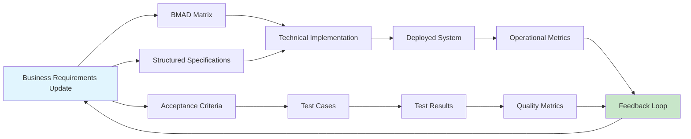

# Business Requirements Collector

## Overview
Collect, analyze, and prioritize business requirements from stakeholders through structured interviews, workshops, and analysis techniques. Bridges the gap between business needs and technical specifications, ensuring complete and validated requirements before development begins. Supports the 13-category classification system based on ISO/IEC 25010:2023.

## When to Use

```
Starting new project? ────────────────────┐
                                          │
Need stakeholder input? ───────────────────┤
                                          ├─► Use business-requirements-collector
Requirements vague or incomplete? ─────────┤
                                          │
Multiple stakeholders with conflicting needs? ┘
```

Use when:
- Starting a new project or major feature
- Business needs are vague or unclear
- Multiple stakeholders with different priorities
- Need to validate assumptions before development
- Requirements documentation is incomplete
- Bridging communication between business and technical teams
- Creating a solid foundation for BMAD mapping

Don't use when:
- Requirements are already clear and validated
- Minor enhancements to existing features
- Technical implementation details only
- Requirements already structured in BMAD format

## Core Pattern

### Comprehensive Requirements Collection Process

```
Stakeholder Identification → Requirement Elicitation → Analysis & Clarification
         ↓                           ↓                           ↓
Stakeholder Map             Raw Requirements         Validated Requirements
         ↓                           ↓                           ↓
┌─────────────────────────────────────────────────────────────────────┐
│                      Prioritization & Approval                      │
└─────────────────────────────────────────────────────────────────────┘
         ↓
Structured Requirements Document
         ↓
Input to BMAD Mapping & Specification
```

### Before (Incomplete Requirements)
```
Business: "We need a customer portal"
Developers: Build basic portal with login
Result: Missing critical features (password reset, profile management, support tickets)
Stakeholders: "This isn't what we wanted!"
```

### After (Structured Collection)
```yaml
# Stakeholder Analysis
stakeholders:
  - role: "Product Manager"
    name: "Jane Smith"
    influence: "high"
    availability: "2 hours/week"
    key_concerns: ["user engagement", "conversion rate"]
    
  - role: "Customer Support Lead"
    name: "Bob Johnson"
    influence: "medium"
    availability: "1 hour/week"
    key_concerns: ["support ticket volume", "common user issues"]
    
  - role: "Sales Director"
    name: "Alice Brown"
    influence: "high"
    availability: "30 minutes/week"
    key_concerns: ["lead generation", "customer retention"]

# Elicited Requirements
raw_requirements:
  - id: "REQ-RAW-001"
    source: "Product Manager"
    statement: "Users should be able to manage their account settings"
    priority: "must"
    ambiguity_level: "low"
    
  - id: "REQ-RAW-002"
    source: "Customer Support Lead"
    statement: "Users need password recovery without calling support"
    priority: "must"
    ambiguity_level: "medium"
    
  - id: "REQ-RAW-003"
    source: "Sales Director"
    statement: "Portal should showcase premium features to free users"
    priority: "should"
    ambiguity_level: "high"

# Clarified Requirements
clarified_requirements:
  - id: "REQ-CLR-001"
    original: "REQ-RAW-001"
    clarification: "Users can update email, password, notification preferences, and profile picture"
    acceptance_criteria:
      - "Email change requires verification"
      - "Password must meet security standards"
      - "Notification preferences saved automatically"
    
  - id: "REQ-CLR-002"
    original: "REQ-RAW-002"
    clarification: "Self-service password reset via email with 15-minute expiration"
    acceptance_criteria:
      - "Reset email within 30 seconds"
      - "Link expires in 15 minutes"
      - "Secure token generation"
    
  - id: "REQ-CLR-003"
    original: "REQ-RAW-003"
    clarification: "Feature comparison table showing free vs premium benefits"
    acceptance_criteria:
      - "Clear visual differentiation"
      - "Upgrade CTAs at key decision points"
      - "Accurate feature availability"

# Prioritization Matrix
prioritization:
  mooscow:
    must_have: ["REQ-CLR-001", "REQ-CLR-002"]
    should_have: ["REQ-CLR-003"]
    could_have: ["Social login integration", "Dark mode"]
    wont_have: ["Biometric authentication", "Multi-language support"]

  business_value:
    high_value_high_effort: []
    high_value_low_effort: ["REQ-CLR-002"]
    low_value_high_effort: []
    low_value_low_effort: ["REQ-CLR-003"]

# Approval Status
approvals:
  - requirement: "REQ-CLR-001"
    approved_by: ["Jane Smith", "Alice Brown"]
    date: "2026-01-20"
    comments: "Basic account management essential"
    
  - requirement: "REQ-CLR-002"
    approved_by: ["Bob Johnson", "Jane Smith"]
    date: "2026-01-20"
    comments: "Critical for support cost reduction"
    
  - requirement: "REQ-CLR-003"
    approved_by: ["Alice Brown"]
    date: "2026-01-21"
    comments: "Deferred to Phase 2, nice-to-have"
```

## Output Location

All requirement documents are stored in `.aether/docs/requirements/` following the 13-category classification:

```
.aether/docs/requirements/
├── 01-business-requirements.md       # Layer 1: Source Dimensions
├── 02-compliance-requirements.md
├── 03-constraint-requirements.md
├── 04-functional-requirements.md     # Layer 2: ISO 25010 Quality
├── 05-performance-requirements.md
├── 06-compatibility-requirements.md
├── 07-usability-requirements.md
├── 08-reliability-requirements.md
├── 09-security-requirements.md
├── 10-maintainability-requirements.md
├── 11-portability-requirements.md
├── 12-architecture-requirements.md   # Layer 3: Architecture & Data
├── 13-data-requirements.md
└── relations.yaml                    # Cross-category relationships
```

### Output Path Helper

```python
from pathlib import Path

class RequirementsOutputManager:
    """Manages output paths for requirement documents."""
    
    REQUIREMENT_FILES = {
        '01': '01-business-requirements.md',
        '02': '02-compliance-requirements.md',
        '03': '03-constraint-requirements.md',
        '04': '04-functional-requirements.md',
        '05': '05-performance-requirements.md',
        '06': '06-compatibility-requirements.md',
        '07': '07-usability-requirements.md',
        '08': '08-reliability-requirements.md',
        '09': '09-security-requirements.md',
        '10': '10-maintainability-requirements.md',
        '11': '11-portability-requirements.md',
        '12': '12-architecture-requirements.md',
        '13': '13-data-requirements.md'
    }
    
    BASE_PATH = '.aether/docs/requirements'
    
    @classmethod
    def get_requirements_path(cls, category_num=None, base_path='.'):
        """Get path for requirements directory or specific file."""
        req_dir = Path(base_path) / cls.BASE_PATH
        req_dir.mkdir(parents=True, exist_ok=True)
        
        if category_num and category_num in cls.REQUIREMENT_FILES:
            return req_dir / cls.REQUIREMENT_FILES[category_num]
        return req_dir
    
    @classmethod
    def get_relations_path(cls, base_path='.'):
        """Get path for cross-category relations file."""
        req_dir = Path(base_path) / cls.BASE_PATH
        req_dir.mkdir(parents=True, exist_ok=True)
        return req_dir / 'relations.yaml'
```

## Quick Reference

### Requirement Types and Collection Methods

| Requirement Type | Collection Methods | Output Format | Stakeholders |
|-----------------|-------------------|---------------|--------------|
| **Functional** | User interviews, use case workshops | Use case diagrams, user stories | End users, product owners |
| **Performance** | Technical interviews, benchmarking | Performance scenarios | Architects, DevOps |
| **Compatibility** | Integration analysis, API review | Interface specifications | Integration specialists |
| **Usability** | User testing, prototyping | Wireframes, user journeys | UX designers, end users |
| **Reliability** | Technical interviews, SLA analysis | Availability requirements | Architects, DevOps |
| **Security** | Security workshops, threat modeling | Security requirements, controls | Security officers, architects |
| **Maintainability** | Code review, technical debt analysis | Quality requirements | Architects, developers |
| **Portability** | Deployment analysis, platform review | Deployment requirements | DevOps, architects |
| **Data** | Data modeling sessions | Entity diagrams, data dictionaries | Database admins, analysts |
| **Compliance** | Regulation analysis, audit reviews | Compliance checklists | Legal, compliance officers |

### Thirteen-Category Requirement Classification Framework (ISO/IEC 25010:2023 Based)

The collector supports the following 13-category requirement classification system:

#### Layer 1: Source Dimensions (3 Categories)

| Category | ID Prefix | Description | Collection Focus | Output Document |
|----------|-----------|-------------|------------------|-----------------|
| **01-Business Requirements** | REQ-BUS | Business goals, value propositions, and strategic objectives | Stakeholder interviews, business workshops | `01-business-requirements.md` |
| **02-Compliance Requirements** | REQ-COMP | Regulatory, legal, and compliance requirements | Compliance reviews, legal consultation | `02-compliance-requirements.md` |
| **03-Constraint Requirements** | REQ-CONS | Budget, timeline, resource, and technical constraints | Project planning, resource analysis | `03-constraint-requirements.md` |

#### Layer 2: Product Quality Dimensions (8 Categories - ISO/IEC 25010:2023)

| Category | ID Prefix | Description | ISO Reference | Output Document |
|----------|-----------|-------------|---------------|-----------------|
| **04-Functional Requirements** | REQ-FUNC | System features, behaviors, and user interactions | Functional Suitability | `04-functional-requirements.md` |
| **05-Performance Requirements** | REQ-PERF | Response time, throughput, capacity, resource utilization | Performance Efficiency | `05-performance-requirements.md` |
| **06-Compatibility Requirements** | REQ-COMPAT | Integration, interoperability, coexistence | Compatibility | `06-compatibility-requirements.md` |
| **07-Usability Requirements** | REQ-USE | User experience, learnability, accessibility | Usability | `07-usability-requirements.md` |
| **08-Reliability Requirements** | REQ-REL | Availability, fault tolerance, recoverability | Reliability | `08-reliability-requirements.md` |
| **09-Security Requirements** | REQ-SEC | Confidentiality, integrity, authentication, authorization | Security | `09-security-requirements.md` |
| **10-Maintainability Requirements** | REQ-MAIN | Modularity, testability, code quality | Maintainability | `10-maintainability-requirements.md` |
| **11-Portability Requirements** | REQ-PORT | Cross-platform, containerization, migration | Portability | `11-portability-requirements.md` |

#### Layer 3: Architecture & Data Dimensions (2 Categories)

| Category | ID Prefix | Description | Collection Focus | Output Document |
|----------|-----------|-------------|------------------|-----------------|
| **12-Architecture Requirements** | REQ-ARCH | Architecture patterns, service boundaries, tech stack | Architecture reviews, technical interviews | `12-architecture-requirements.md` |
| **13-Data Requirements** | REQ-DATA | Data models, data quality, data governance | Data modeling, governance workshops | `13-data-requirements.md` |

### ISO/IEC 25010:2023 Subcharacteristics

| Quality Characteristic | Subcharacteristics |
|------------------------|-------------------|
| **Functional Suitability** | Completeness, Correctness, Appropriateness |
| **Performance Efficiency** | Time Behaviour, Resource Utilization, Capacity |
| **Compatibility** | Co-existence, Interoperability |
| **Usability** | Appropriateness Recognizability, Learnability, Operability, User Error Protection, User Interface Aesthetics, Accessibility |
| **Reliability** | Maturity, Availability, Fault Tolerance, Recoverability |
| **Security** | Confidentiality, Integrity, Non-repudiation, Accountability, Auditability |
| **Maintainability** | Analysability, Modifiability, Testability, Reusability, Modularity |
| **Portability** | Adaptability, Installability, Replaceability |

#### Cross-Category Relationships

Requirements often have relationships across categories. The collector tracks these relationships:

```yaml
requirement_relations:
  drives:
    description: "One requirement drives the creation of another"
    example: "REQ-BUS-001 drives REQ-FUNC-001"
    
  constrains:
    description: "One requirement imposes constraints on another"
    example: "REQ-CONS-001 constrains REQ-ARCH-001"
    
  mandates:
    description: "Compliance mandates other requirements"
    example: "REQ-COMP-001 mandates REQ-SEC-001"
    
  depends_on:
    description: "One requirement depends on another"
    example: "REQ-FUNC-003 depends on REQ-DATA-002"
    
  conflicts_with:
    description: "Requirements have conflicting objectives"
    example: "REQ-SEC-001 conflicts with REQ-PERF-002"
    
  trades_off:
    description: "Quality trade-off (ISO 25010)"
    example: "REQ-SEC-001 trades_off REQ-PERF-001"
    
  validates:
    description: "One requirement validates another"
    example: "REQ-COMP-001 validates REQ-SEC-005"
    
  influences:
    description: "One quality influences another"
    example: "REQ-ARCH-001 influences REQ-PERF-001"
```

### Requirement Attributes Template

```yaml
requirement:
  id: "REQ-{CATEGORY}-{NUMBER}"
  version: "1.0"
  status: "draft | reviewed | approved | implemented"
  
  # Requirement Category (13-Category System)
  category: "01_business | 02_compliance | 03_constraint | 04_functional | 
             05_performance | 06_compatibility | 07_usability | 08_reliability | 
             09_security | 10_maintainability | 11_portability | 12_architecture | 13_data"
  
  # ISO Reference (for quality categories)
  iso_reference: "ISO/IEC 25010:2023 - {Quality Characteristic}"
  subcategory: "Subcharacteristic name"
  
  # Core attributes
  description: "Clear, concise requirement statement"
  rationale: "Business or user need driving this requirement"
  source: "Stakeholder(s) who requested this"
  
  # Classification
  type: "functional | quality | business-rule | constraint | data"
  priority: "critical | high | medium | low"
  stability: "stable | likely-to-change | volatile"
  
  # Cross-Category Relationships
  cross_category_relations:
    - related_category: "04_functional"
      relation_type: "drives | constrains | depends_on | conflicts_with | trades_off | validates | influences"
      related_requirement: "REQ-FUNC-001"
      rationale: "Business requirement drives functional implementation"
  
  # Traditional Relationships
  parent: "Parent requirement ID if hierarchical"
  dependencies: ["List of requirement IDs this depends on"]
  conflicts: ["List of conflicting requirement IDs"]
  related: ["List of related requirement IDs"]
  
  # Quality attributes
  testability: "How this requirement will be tested"
  measurability: "How success will be measured"
  ambiguity_level: "low | medium | high"
  
  # Stakeholder information
  requested_by: "Stakeholder name and role"
  approved_by: "List of approvers"
  business_value: "Estimated business impact (high/medium/low)"
  
  # Technical implications
  complexity: "simple | moderate | complex"
  effort_estimate: "T-shirt size or hours"
  technical_risks: ["List of potential technical risks"]
  
  # Acceptance criteria
  acceptance_criteria:
    - id: "AC-001"
      description: "Specific, testable condition"
      test_method: "manual | automated | both"
      priority: "must | should | could"
  
  # Supporting artifacts
  attachments:
    - type: "wireframe | diagram | document"
      file: "path/to/artifact"
      description: "What this artifact shows"
```

### Thirteen-Category Requirement Examples

#### 01-业务需求 Example
```yaml
requirement:
  id: "REQ-BUS-001"
  category: "01_business"
  description: "Increase customer retention rate by 20% through improved user experience"
  rationale: "Current retention rate of 65% is below industry average of 75%"
  source: "Product Manager"
  priority: "critical"
  business_value: "high"
  
  cross_category_relations:
    - related_category: "04_functional"
      relation_type: "drives"
      related_requirement: "REQ-FUNC-001"
      rationale: "Business goal drives user onboarding feature"
    - related_category: "05_performance"
      relation_type: "constrains"
      related_requirement: "REQ-PERF-001"
      rationale: "Retention goal constrains performance requirements"
  
  acceptance_criteria:
    - id: "AC-BUS-001-1"
      description: "Customer retention rate reaches 85% within 6 months"
      test_method: "automated"
      priority: "must"
```

#### 02-合规需求 Example
```yaml
requirement:
  id: "REQ-COMP-001"
  category: "02_compliance"
  description: "System must comply with GDPR data protection requirements"
  rationale: "EU market requires GDPR compliance for data processing"
  source: "Legal Counsel"
  priority: "critical"
  
  cross_category_relations:
    - related_category: "09_security"
      relation_type: "mandates"
      related_requirement: "REQ-SEC-003"
      rationale: "Compliance mandates security data protection"
    - related_category: "04_functional"
      relation_type: "constrains"
      related_requirement: "REQ-FUNC-010"
      rationale: "GDPR constrains data collection features"
  
  acceptance_criteria:
    - id: "AC-COMP-001-1"
      description: "User consent obtained before data collection"
      test_method: "manual"
      priority: "must"
```

#### 03-约束需求 Example
```yaml
requirement:
  id: "REQ-CONS-001"
  category: "03_constraint"
  description: "Project must be delivered within $50,000 budget and 4-month timeline"
  rationale: "Limited funding and market window"
  source: "Project Sponsor"
  priority: "critical"
  
  cross_category_relations:
    - related_category: "12_architecture"
      relation_type: "constrains"
      related_requirement: "REQ-ARCH-001"
      rationale: "Budget constrains architecture choices"
    - related_category: "08_reliability"
      relation_type: "constrains"
      related_requirement: "REQ-REL-001"
      rationale: "Timeline constrains reliability investments"
  
  acceptance_criteria:
    - id: "AC-CONS-001-1"
      description: "Total project cost does not exceed $50,000"
      test_method: "manual"
      priority: "must"
```

#### 04-功能需求 Example
```yaml
requirement:
  id: "REQ-FUNC-001"
  category: "04_functional"
  iso_reference: "ISO/IEC 25010:2023 - Functional Suitability"
  subcategory: "appropriateness"
  description: "Users can register using email or social login"
  rationale: "Multiple registration options improve user acquisition"
  source: "Product Owner"
  priority: "high"
  
  cross_category_relations:
    - related_category: "01_business"
      relation_type: "driven_by"
      related_requirement: "REQ-BUS-001"
      rationale: "Functional requirement driven by business goal"
    - related_category: "09_security"
      relation_type: "depends_on"
      related_requirement: "REQ-SEC-001"
      rationale: "Registration depends on security requirements"
  
  acceptance_criteria:
    - id: "AC-FUNC-001-1"
      description: "Email registration sends verification email within 30 seconds"
      test_method: "automated"
      priority: "must"
```

#### 05-性能需求 Example
```yaml
requirement:
  id: "REQ-PERF-001"
  category: "05_performance"
  iso_reference: "ISO/IEC 25010:2023 - Performance Efficiency"
  subcategory: "time_behaviour"
  description: "API response time must be less than 200ms at P95"
  rationale: "Fast response times improve user experience and retention"
  source: "Performance Engineer"
  priority: "high"
  
  cross_category_relations:
    - related_category: "01_business"
      relation_type: "supports"
      related_requirement: "REQ-BUS-001"
      rationale: "Performance supports business retention goal"
    - related_category: "09_security"
      relation_type: "trades_off"
      related_requirement: "REQ-SEC-001"
      rationale: "Performance may trade off with security encryption"
  
  acceptance_criteria:
    - id: "AC-PERF-001-1"
      description: "95% of API requests complete within 200ms"
      test_method: "automated"
      priority: "must"
```

#### 06-兼容性需求 Example
```yaml
requirement:
  id: "REQ-COMPAT-001"
  category: "06_compatibility"
  iso_reference: "ISO/IEC 25010:2023 - Compatibility"
  subcategory: "interoperability"
  description: "System must integrate with SAP ERP via REST API"
  rationale: "Enterprise customers require SAP integration"
  source: "Enterprise Sales"
  priority: "high"
  
  cross_category_relations:
    - related_category: "04_functional"
      relation_type: "enables"
      related_requirement: "REQ-FUNC-015"
      rationale: "Integration enables data sync functionality"
  
  acceptance_criteria:
    - id: "AC-COMPAT-001-1"
      description: "Data syncs with SAP every 5 minutes with <1% error rate"
      test_method: "automated"
      priority: "must"
```

#### 07-可用性需求 Example
```yaml
requirement:
  id: "REQ-USE-001"
  category: "07_usability"
  iso_reference: "ISO/IEC 25010:2023 - Usability"
  subcategory: "learnability"
  description: "New users can complete core tasks within 5 minutes without training"
  rationale: "Reduce onboarding friction and support costs"
  source: "UX Designer"
  priority: "high"
  
  cross_category_relations:
    - related_category: "01_business"
      relation_type: "supports"
      related_requirement: "REQ-BUS-001"
      rationale: "Usability supports retention goal"
  
  acceptance_criteria:
    - id: "AC-USE-001-1"
      description: "90% of new users complete core tasks in <5 min"
      test_method: "manual"
      priority: "must"
```

#### 08-可靠性需求 Example
```yaml
requirement:
  id: "REQ-REL-001"
  category: "08_reliability"
  iso_reference: "ISO/IEC 25010:2023 - Reliability"
  subcategory: "availability"
  description: "System availability must be 99.9% with MTTR < 15 minutes"
  rationale: "Enterprise SLA requirements"
  source: "DevOps Lead"
  priority: "critical"
  
  cross_category_relations:
    - related_category: "12_architecture"
      relation_type: "depends_on"
      related_requirement: "REQ-ARCH-001"
      rationale: "Reliability depends on architecture design"
    - related_category: "05_performance"
      relation_type: "trades_off"
      related_requirement: "REQ-PERF-002"
      rationale: "Redundancy may impact performance"
  
  acceptance_criteria:
    - id: "AC-REL-001-1"
      description: "Monthly uptime >= 99.9% with MTTR < 15 min"
      test_method: "automated"
      priority: "must"
```

#### 09-安全需求 Example
```yaml
requirement:
  id: "REQ-SEC-001"
  category: "09_security"
  iso_reference: "ISO/IEC 25010:2023 - Security"
  subcategory: "confidentiality"
  description: "All user passwords must be hashed using bcrypt with minimum 12 rounds"
  rationale: "Bcrypt provides strong protection against password cracking"
  source: "Security Officer"
  priority: "critical"
  
  cross_category_relations:
    - related_category: "02_compliance"
      relation_type: "supports"
      related_requirement: "REQ-COMP-001"
      rationale: "Password hashing supports GDPR compliance"
    - related_category: "05_performance"
      relation_type: "trades_off"
      related_requirement: "REQ-PERF-005"
      rationale: "Security constraints affect performance"
  
  acceptance_criteria:
    - id: "AC-SEC-001-1"
      description: "Password hashing uses bcrypt with 12+ rounds"
      test_method: "automated"
      priority: "must"
```

#### 10-可维护性需求 Example
```yaml
requirement:
  id: "REQ-MAIN-001"
  category: "10_maintainability"
  iso_reference: "ISO/IEC 25010:2023 - Maintainability"
  subcategory: "testability"
  description: "Code must have minimum 80% test coverage with all critical paths covered"
  rationale: "Enable confident refactoring and reduce regression bugs"
  source: "Tech Lead"
  priority: "high"
  
  cross_category_relations:
    - related_category: "08_reliability"
      relation_type: "supports"
      related_requirement: "REQ-REL-001"
      rationale: "Testability supports reliability"
  
  acceptance_criteria:
    - id: "AC-MAIN-001-1"
      description: "Test coverage >= 80% with critical paths 100%"
      test_method: "automated"
      priority: "must"
```

#### 11-可移植性需求 Example
```yaml
requirement:
  id: "REQ-PORT-001"
  category: "11_portability"
  iso_reference: "ISO/IEC 25010:2023 - Portability"
  subcategory: "adaptability"
  description: "Application must be containerized and deployable on AWS, Azure, and GCP"
  rationale: "Multi-cloud strategy for enterprise customers"
  source: "DevOps Lead"
  priority: "high"
  
  cross_category_relations:
    - related_category: "12_architecture"
      relation_type: "depends_on"
      related_requirement: "REQ-ARCH-001"
      rationale: "Portability depends on architecture design"
  
  acceptance_criteria:
    - id: "AC-PORT-001-1"
      description: "Deployment succeeds on AWS, Azure, GCP within 30 minutes"
      test_method: "automated"
      priority: "must"
```

#### 12-架构需求 Example
```yaml
requirement:
  id: "REQ-ARCH-001"
  category: "12_architecture"
  description: "System must follow microservices architecture with clear service boundaries"
  rationale: "Monolithic architecture limits scalability and deployment velocity"
  source: "Technical Architect"
  priority: "high"
  
  cross_category_relations:
    - related_category: "04_functional"
      relation_type: "constrains"
      related_requirement: "REQ-FUNC-005"
      rationale: "Microservices architecture constrains feature design"
    - related_category: "05_performance"
      relation_type: "influences"
      related_requirement: "REQ-PERF-001"
      rationale: "Architecture influences performance characteristics"
  
  acceptance_criteria:
    - id: "AC-ARCH-001-1"
      description: "Each service has single responsibility and clear API boundary"
      test_method: "manual"
      priority: "must"
```

#### 13-数据需求 Example
```yaml
requirement:
  id: "REQ-DATA-001"
  category: "13_data"
  description: "User data must be retained for 7 years with audit trail"
  rationale: "Regulatory requirement for financial data"
  source: "Compliance Officer"
  priority: "critical"
  
  cross_category_relations:
    - related_category: "02_compliance"
      relation_type: "driven_by"
      related_requirement: "REQ-COMP-001"
      rationale: "Data retention driven by compliance"
    - related_category: "04_functional"
      relation_type: "constrains"
      related_requirement: "REQ-FUNC-020"
      rationale: "Data retention constrains delete functionality"
  
  acceptance_criteria:
    - id: "AC-DATA-001-1"
      description: "All user data retained 7 years with complete audit trail"
      test_method: "automated"
      priority: "must"
```

### Elicitation Technique Selection Guide

| Situation | Recommended Techniques | Expected Output |
|-----------|----------------------|-----------------|
| **New domain, unfamiliar users** | Contextual inquiry, ethnographic studies | User workflows, pain points |
| **Complex business rules** | Decision tables, rule analysis | Clear business rules |
| **User interface design** | Prototyping, usability testing | Validated UI designs |
| **Performance requirements** | Benchmarking, load testing | Performance thresholds |
| **Integration needs** | Interface analysis, API design | Interface specifications |
| **Security concerns** | Threat modeling, security workshops | Security controls |
| **Stakeholder conflicts** | Facilitation, negotiation, prioritization | Consensus on priorities |

## Implementation

### Stakeholder Identification and Analysis

```python
class StakeholderAnalyzer:
    """Identify and analyze project stakeholders."""
    
    def identify_stakeholders(self, project_scope):
        """Identify all stakeholders for a project."""
        
        stakeholders = []
        
        # Internal stakeholders
        stakeholders.extend(self._identify_internal_stakeholders(project_scope))
        
        # External stakeholders
        stakeholders.extend(self._identify_external_stakeholders(project_scope))
        
        # Indirect stakeholders
        stakeholders.extend(self._identify_indirect_stakeholders(project_scope))
        
        return self._analyze_stakeholder_attributes(stakeholders)
    
    def _identify_internal_stakeholders(self, project_scope):
        """Identify internal organizational stakeholders."""
        
        internal_roles = [
            ('Product Owner', 'high', 'Defines what to build'),
            ('Business Analyst', 'high', 'Translates business to technical'),
            ('Development Lead', 'high', 'Technical implementation'),
            ('QA Manager', 'medium', 'Quality assurance'),
            ('UX Designer', 'medium', 'User experience design'),
            ('DevOps Engineer', 'medium', 'Deployment and operations'),
            ('Security Officer', 'medium', 'Security compliance'),
            ('Data Architect', 'medium', 'Data requirements'),
            ('Legal Counsel', 'low', 'Legal and compliance')
        ]
        
        return [
            {
                'role': role,
                'influence': influence,
                'responsibility': responsibility,
                'type': 'internal',
                'engagement_level': self._determine_engagement(project_scope, role)
            }
            for role, influence, responsibility in internal_roles
            if self._is_relevant(project_scope, role)
        ]
    
    def create_stakeholder_map(self, stakeholders):
        """Create stakeholder influence/interest map."""
        
        return {
            'high_influence_high_interest': [
                s for s in stakeholders
                if s['influence'] == 'high' and s['interest'] == 'high'
            ],
            'high_influence_low_interest': [
                s for s in stakeholders
                if s['influence'] == 'high' and s['interest'] == 'low'
            ],
            'low_influence_high_interest': [
                s for s in stakeholders
                if s['influence'] == 'low' and s['interest'] == 'high'
            ],
            'low_influence_low_interest': [
                s for s in stakeholders
                if s['influence'] == 'low' and s['interest'] == 'low'
            ]
        }
```

### Requirement Analysis and Clarification

```python
class RequirementAnalyzer:
    """Analyze and clarify ambiguous requirements."""
    
    def analyze_requirement(self, raw_requirement):
        """Analyze a raw requirement for clarity and completeness."""
        
        analysis = {
            'original': raw_requirement,
            'clarity_score': self._assess_clarity(raw_requirement),
            'completeness_score': self._assess_completeness(raw_requirement),
            'ambiguities': self._identify_ambiguities(raw_requirement),
            'missing_elements': self._identify_missing_elements(raw_requirement),
            'clarification_questions': self._generate_clarification_questions(raw_requirement),
            'suggested_category': self._suggest_category(raw_requirement),
            'iso_reference': self._suggest_iso_reference(raw_requirement)
        }
        
        return analysis
    
    def _suggest_category(self, raw_requirement):
        """Suggest requirement category based on content analysis."""
        
        statement = raw_requirement.get('statement', '').lower()
        
        # Layer 1: Source dimensions
        if any(kw in statement for kw in ['revenue', 'market', 'customer', 'roi', 'kpi']):
            return '01_business'
        if any(kw in statement for kw in ['gdpr', 'iso', 'compliance', 'regulation', 'audit']):
            return '02_compliance'
        if any(kw in statement for kw in ['budget', 'timeline', 'deadline', 'resource']):
            return '03_constraint'
        
        # Layer 2: Quality dimensions (ISO 25010)
        if any(kw in statement for kw in ['user can', 'system shall', 'feature']):
            return '04_functional'
        if any(kw in statement for kw in ['response time', 'throughput', 'latency', 'performance']):
            return '05_performance'
        if any(kw in statement for kw in ['integrate', 'compatible', 'api', 'interoperability']):
            return '06_compatibility'
        if any(kw in statement for kw in ['usability', 'learn', 'accessible', 'ux']):
            return '07_usability'
        if any(kw in statement for kw in ['availability', 'reliability', 'mtbf', 'mttr']):
            return '08_reliability'
        if any(kw in statement for kw in ['security', 'encrypt', 'auth', 'password']):
            return '09_security'
        if any(kw in statement for kw in ['maintainable', 'modular', 'testable', 'coverage']):
            return '10_maintainability'
        if any(kw in statement for kw in ['portable', 'container', 'cloud', 'deploy']):
            return '11_portability'
        
        # Layer 3: Architecture & Data
        if any(kw in statement for kw in ['architecture', 'microservice', 'design pattern']):
            return '12_architecture'
        if any(kw in statement for kw in ['data model', 'data quality', 'retention', 'governance']):
            return '13_data'
        
        return '04_functional'  # Default
    
    def _suggest_iso_reference(self, raw_requirement, category):
        """Suggest ISO 25010 reference for quality categories."""
        
        iso_mapping = {
            '04_functional': 'ISO/IEC 25010:2023 - Functional Suitability',
            '05_performance': 'ISO/IEC 25010:2023 - Performance Efficiency',
            '06_compatibility': 'ISO/IEC 25010:2023 - Compatibility',
            '07_usability': 'ISO/IEC 25010:2023 - Usability',
            '08_reliability': 'ISO/IEC 25010:2023 - Reliability',
            '09_security': 'ISO/IEC 25010:2023 - Security',
            '10_maintainability': 'ISO/IEC 25010:2023 - Maintainability',
            '11_portability': 'ISO/IEC 25010:2023 - Portability'
        }
        
        return iso_mapping.get(category)
    
    def clarify_requirement(self, raw_requirement, stakeholder_feedback):
        """Clarify ambiguous requirement using stakeholder feedback."""
        
        clarified = {
            'id': f"REQ-CLR-{generate_id()}",
            'original_id': raw_requirement.get('id'),
            'original_statement': raw_requirement['statement'],
            'clarified_statement': raw_requirement['statement'],
            'category': raw_requirement.get('suggested_category', '04_functional'),
            'iso_reference': raw_requirement.get('iso_reference'),
            'assumptions': [],
            'constraints': [],
            'acceptance_criteria': [],
            'dependencies': []
        }
        
        # Apply stakeholder feedback
        if stakeholder_feedback.get('clarification'):
            clarified['clarified_statement'] = stakeholder_feedback['clarification']
        
        # Extract assumptions
        if stakeholder_feedback.get('assumptions'):
            clarified['assumptions'] = stakeholder_feedback['assumptions']
        else:
            clarified['assumptions'] = self._infer_assumptions(raw_requirement)
        
        # Extract constraints
        if stakeholder_feedback.get('constraints'):
            clarified['constraints'] = stakeholder_feedback['constraints']
        
        # Generate acceptance criteria
        clarified['acceptance_criteria'] = self._derive_acceptance_criteria(
            clarified['clarified_statement'],
            raw_requirement.get('context', {})
        )
        
        # Identify dependencies
        clarified['dependencies'] = self._identify_dependencies(
            clarified['clarified_statement'],
            raw_requirement.get('context', {})
        )
        
        return clarified
    
    def validate_requirement_set(self, requirements):
        """Validate complete set of requirements for consistency and completeness."""
        
        validation = {
            'consistency_check': self._check_consistency(requirements),
            'completeness_check': self._check_completeness(requirements),
            'conflict_detection': self._detect_conflicts(requirements),
            'gap_analysis': self._perform_gap_analysis(requirements),
            'traceability_check': self._check_traceability(requirements),
            'prioritization_validation': self._validate_prioritization(requirements),
            'iso_coverage_check': self._check_iso_coverage(requirements)
        }
        
        return validation
    
    def _check_iso_coverage(self, requirements):
        """Check coverage of ISO 25010 quality characteristics."""
        
        iso_categories = ['04_functional', '05_performance', '06_compatibility',
                         '07_usability', '08_reliability', '09_security',
                         '10_maintainability', '11_portability']
        
        coverage = {}
        for cat in iso_categories:
            coverage[cat] = len([r for r in requirements if r.get('category') == cat])
        
        missing = [cat for cat, count in coverage.items() if count == 0]
        
        return {
            'coverage': coverage,
            'missing_categories': missing,
            'recommendation': 'Consider adding requirements for missing quality categories'
        }
```

### Prioritization Framework

```python
class RequirementPrioritizer:
    """Prioritize requirements using multiple frameworks."""
    
    def prioritize(self, requirements, business_context):
        """Prioritize requirements using appropriate framework."""
        
        # Apply MoSCoW method
        moscow_prioritization = self._apply_moscow(requirements, business_context)
        
        # Apply business value vs effort matrix
        value_effort_prioritization = self._apply_value_effort_matrix(requirements, business_context)
        
        # Apply Kano model for customer satisfaction
        kano_prioritization = self._apply_kano_model(requirements, business_context)
        
        # Apply ISO 25010 quality priority
        iso_prioritization = self._apply_iso_priority(requirements, business_context)
        
        # Combine prioritizations
        combined = self._combine_prioritizations(
            moscow_prioritization,
            value_effort_prioritization,
            kano_prioritization,
            iso_prioritization
        )
        
        # Create release planning recommendation
        release_plan = self._create_release_plan(combined, business_context)
        
        return {
            'individual_prioritizations': {
                'moscow': moscow_prioritization,
                'value_effort': value_effort_prioritization,
                'kano': kano_prioritization,
                'iso_quality': iso_prioritization
            },
            'combined_prioritization': combined,
            'release_plan': release_plan,
            'rationale': self._generate_prioritization_rationale(combined, business_context)
        }
    
    def _apply_iso_priority(self, requirements, context):
        """Apply ISO 25010 quality priority based on project context."""
        
        # Define priority based on project type
        project_type_priorities = {
            'enterprise': {
                '08_reliability': 'critical',
                '09_security': 'critical',
                '02_compliance': 'critical',
                '05_performance': 'high',
                '07_usability': 'medium'
            },
            'consumer': {
                '07_usability': 'critical',
                '05_performance': 'high',
                '04_functional': 'high',
                '09_security': 'high',
                '08_reliability': 'high'
            },
            'internal': {
                '10_maintainability': 'high',
                '08_reliability': 'high',
                '04_functional': 'high',
                '07_usability': 'medium'
            }
        }
        
        project_type = context.get('project_type', 'enterprise')
        priorities = project_type_priorities.get(project_type, {})
        
        iso_priority = {}
        for req in requirements:
            category = req.get('category', '04_functional')
            iso_priority[req['id']] = priorities.get(category, 'medium')
        
        return iso_priority
```

### Requirements Documentation

```python
class RequirementsDocumenter:
    """Create comprehensive requirements documentation."""
    
    def create_requirements_specification(self, requirements, analysis, prioritization):
        """Create formal requirements specification document."""
        
        spec = {
            'metadata': {
                'project': analysis.get('project_name', 'Unknown Project'),
                'version': '1.0',
                'created_date': datetime.now().isoformat(),
                'status': 'draft',
                'iso_standard': 'ISO/IEC 25010:2023',
                'stakeholders': analysis.get('stakeholders', [])
            },
            
            'executive_summary': {
                'project_overview': analysis.get('project_overview', ''),
                'business_objectives': analysis.get('business_objectives', []),
                'key_requirements': self._extract_key_requirements(requirements, prioritization),
                'success_criteria': analysis.get('success_criteria', [])
            },
            
            'stakeholder_analysis': analysis.get('stakeholder_analysis', {}),
            
            'requirements_catalog': {
                'layer_1_source': {
                    '01_business': self._categorize_requirements(requirements, '01_business'),
                    '02_compliance': self._categorize_requirements(requirements, '02_compliance'),
                    '03_constraint': self._categorize_requirements(requirements, '03_constraint')
                },
                'layer_2_quality': {
                    '04_functional': self._categorize_requirements(requirements, '04_functional'),
                    '05_performance': self._categorize_requirements(requirements, '05_performance'),
                    '06_compatibility': self._categorize_requirements(requirements, '06_compatibility'),
                    '07_usability': self._categorize_requirements(requirements, '07_usability'),
                    '08_reliability': self._categorize_requirements(requirements, '08_reliability'),
                    '09_security': self._categorize_requirements(requirements, '09_security'),
                    '10_maintainability': self._categorize_requirements(requirements, '10_maintainability'),
                    '11_portability': self._categorize_requirements(requirements, '11_portability')
                },
                'layer_3_architecture_data': {
                    '12_architecture': self._categorize_requirements(requirements, '12_architecture'),
                    '13_data': self._categorize_requirements(requirements, '13_data')
                }
            },
            
            'iso_25010_coverage': self._analyze_iso_coverage(requirements),
            
            'prioritization': prioritization,
            
            'acceptance_criteria': {
                'by_requirement': self._compile_acceptance_criteria(requirements),
                'overall_acceptance': analysis.get('overall_acceptance_criteria', [])
            },
            
            'assumptions_and_constraints': {
                'assumptions': analysis.get('assumptions', []),
                'constraints': analysis.get('constraints', []),
                'dependencies': analysis.get('dependencies', [])
            },
            
            'glossary': self._create_glossary(requirements),
            
            'appendices': {
                'elicitation_artifacts': analysis.get('elicitation_artifacts', []),
                'interview_transcripts': analysis.get('interview_transcripts', []),
                'workshop_outputs': analysis.get('workshop_outputs', [])
            }
        }
        
        return spec
    
    def _analyze_iso_coverage(self, requirements):
        """Analyze ISO 25010 quality characteristics coverage."""
        
        iso_characteristics = {
            'Functional Suitability': '04_functional',
            'Performance Efficiency': '05_performance',
            'Compatibility': '06_compatibility',
            'Usability': '07_usability',
            'Reliability': '08_reliability',
            'Security': '09_security',
            'Maintainability': '10_maintainability',
            'Portability': '11_portability'
        }
        
        coverage = {}
        for characteristic, category in iso_characteristics.items():
            count = len([r for r in requirements if r.get('category') == category])
            coverage[characteristic] = {
                'category': category,
                'requirement_count': count,
                'status': 'covered' if count > 0 else 'missing'
            }
        
        return coverage
    
    def generate_traceability_matrix(self, requirements, business_objectives):
        """Generate requirements traceability matrix."""
        
        matrix = []
        
        for objective in business_objectives:
            objective_row = {
                'business_objective': objective['id'],
                'description': objective['description'],
                'related_requirements': []
            }
            
            for req in requirements:
                if self._is_requirement_related_to_objective(req, objective):
                    objective_row['related_requirements'].append({
                        'requirement_id': req['id'],
                        'category': req.get('category', 'unknown'),
                        'iso_reference': req.get('iso_reference'),
                        'relationship_strength': self._calculate_relationship_strength(req, objective),
                        'rationale': self._explain_relationship(req, objective)
                    })
            
            matrix.append(objective_row)
        
        return matrix
```

## Common Mistakes

| Mistake | Why It's Wrong | Fix |
|---------|---------------|-----|
| **Jumping to solutions** | Captures implementation instead of need | Ask "what problem are we solving?" not "what should we build?" |
| **Ignoring quality requirements** | System meets functional needs but fails on performance, security, etc. | Use ISO 25010 checklist to ensure all quality characteristics covered |
| **Single stakeholder perspective** | Misses needs of other important stakeholders | Identify and engage all relevant stakeholder groups |
| **Vague requirement statements** | Leads to different interpretations, rework | Apply SMART criteria (Specific, Measurable, Achievable, Relevant, Time-bound) |
| **No prioritization** | Everything seems equally important, inefficient resource allocation | Use structured prioritization frameworks (MoSCoW, value vs effort) |
| **Skipping validation** | Requirements may be incorrect or incomplete | Review with stakeholders, create prototypes, conduct workshops |
| **Documentation as afterthought** | Knowledge lost, hard to trace decisions | Document throughout elicitation process |
| **Assuming requirements are static** | Business needs change, requirements evolve | Plan for change, establish change control process |
| **Missing ISO 25010 coverage** | Quality gaps discovered late in development | Validate ISO 25010 coverage during collection |

### Red Flags

- Requirements stated as solutions ("We need a database")
- Vague terms ("user-friendly", "fast", "scalable") without quantification
- Conflicting requirements from different stakeholders
- No clear ownership or approval process
- Requirements not traceable to business objectives
- Missing acceptance criteria
- Stakeholders unavailable for clarification
- Requirements documentation outdated or incomplete
- ISO 25010 quality characteristics not covered

## Real-World Impact

**Before (Poor Requirements):**
- Project starts with vague statement: "Build a customer portal"
- Developers implement basic features
- Testing reveals missing critical functionality
- Quality requirements not considered
- Stakeholders reject deliverable
- Rework required: 40% of effort wasted
- Timeline extended by 2 months
- Team morale suffers

**After (Structured Collection):**
- Comprehensive stakeholder analysis identifies all parties
- Structured interviews uncover real needs
- ISO 25010 checklist ensures quality coverage
- Requirements clarified and validated before coding
- Prioritization ensures focus on high-value features
- Traceability matrix links requirements to business goals
- Development builds right features from start
- Testing confirms requirements met
- Stakeholders accept deliverable with minor changes

**Outcome:** 30% faster delivery, 50% less rework, higher stakeholder satisfaction, clearer project direction, ISO standard compliance.

## Integration with Aether.go Methodology

### Integration with BMAD Framework

```yaml
# Business Requirements → BMAD Mapping
business_requirements_collector:
  output: "validated_requirements.yaml"
  
bmad_mapper:
  input: "validated_requirements.yaml"
  process:
    1. Extract business objectives from requirements
    2. Identify measurable metrics for each objective
    3. Define technical actions to achieve metrics
    4. Specify data collection methods
  output: "bmad_matrix.yaml"

# Example flow
requirement: "Users can reset password without support intervention"
  → business_objective: "Reduce support ticket volume by 50%"
  → metric: "Password-related support tickets per month"
  → action: "Implement self-service password reset"
  → data: "Support ticket system analytics"
```

### Integration with Specification Development

```yaml
# Requirements → Specifications
requirements_collector:
  artifacts:
    - stakeholder_analysis.md
    - requirement_catalog.yaml
    - acceptance_criteria.md
    - traceability_matrix.csv
    - iso_coverage_report.yaml

spec_parser:
  inputs:
    - requirement_catalog.yaml
    - acceptance_criteria.md
  process:
    1. Parse natural language requirements
    2. Structure into machine-readable format
    3. Validate ISO 25010 mapping
    4. Generate initial specifications
  output: "structured_specs.yaml"

bdd_scenario_writer:
  inputs:
    - requirement_catalog.yaml
    - acceptance_criteria.md
  process:
    1. Convert acceptance criteria to Gherkin
    2. Add context and examples
    3. Validate testability
  output: "*.feature files"
```

### Constitution Integration

```yaml
# Constitutional Requirements Integration
constitution_principles:
  - principle: "Value-Driven Requirements"
    check: "Every requirement traces to business value"
    enforcement: "strict"
    validation_method: "traceability_matrix_completeness"
    
  - principle: "ISO 25010 Coverage"
    check: "All relevant ISO 25010 quality characteristics covered"
    enforcement: "warning"
    validation_method: "iso_coverage_check"
    
  - principle: "Stakeholder Inclusivity"
    check: "All relevant stakeholders identified and engaged"
    enforcement: "warning"
    validation_method: "stakeholder_analysis_coverage"
    
  - principle: "Clarity and Testability"
    check: "All requirements have clear acceptance criteria"
    enforcement: "strict"
    validation_method: "acceptance_criteria_coverage"
    
  - principle: "Realistic Prioritization"
    check: "Requirements prioritized based on business value and feasibility"
    enforcement: "warning"
    validation_method: "prioritization_rationale_quality"

constitution_validator:
  input: "requirements_specification.yaml"
  checks:
    - principle: "Value-Driven Requirements"
      query: "SELECT COUNT(*) FROM requirements WHERE business_value_rationale IS NULL"
      threshold: "0"
      
    - principle: "ISO 25010 Coverage"
      query: "SELECT COUNT(*) FROM iso_characteristics WHERE requirement_count = 0"
      threshold: "depends_on_project_type"
      
    - principle: "Clarity and Testability"
      query: "SELECT COUNT(*) FROM requirements WHERE acceptance_criteria_count = 0"
      threshold: "0"
```

### Traceability Throughout Lifecycle



This integration ensures that business requirements collected at the beginning flow through the entire development lifecycle, with traceability maintained at every stage and feedback loops enabling continuous improvement. ISO/IEC 25010:2023 provides the quality framework for comprehensive requirement coverage.
