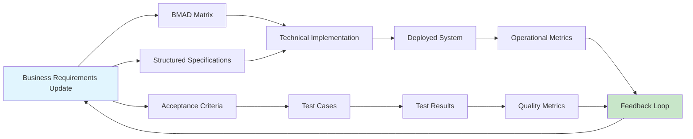

# Business Requirements Collector

## Overview
Collect, analyze, and prioritize business requirements from stakeholders through structured interviews, workshops, and analysis techniques. Bridges the gap between business needs and technical specifications, ensuring complete and validated requirements before development begins.

## When to Use

```
Starting new project? ────────────────────┐
                                          │
Need stakeholder input? ───────────────────┤
                                          ├─► Use business-requirements-collector
Requirements vague or incomplete? ─────────┤
                                          │
Multiple stakeholders with conflicting needs? ┘
```

Use when:
- Starting a new project or major feature
- Business needs are vague or unclear
- Multiple stakeholders with different priorities
- Need to validate assumptions before development
- Requirements documentation is incomplete
- Bridging communication between business and technical teams
- Creating a solid foundation for BMAD mapping

Don't use when:
- Requirements are already clear and validated
- Minor enhancements to existing features
- Technical implementation details only
- Requirements already structured in BMAD format

## Core Pattern

### Comprehensive Requirements Collection Process

```
Stakeholder Identification → Requirement Elicitation → Analysis & Clarification
         ↓                           ↓                           ↓
Stakeholder Map             Raw Requirements         Validated Requirements
         ↓                           ↓                           ↓
┌─────────────────────────────────────────────────────────────────────┐
│                      Prioritization & Approval                      │
└─────────────────────────────────────────────────────────────────────┘
         ↓
Structured Requirements Document
         ↓
Input to BMAD Mapping & Specification
```

### Before (Incomplete Requirements)
```
Business: "We need a customer portal"
Developers: Build basic portal with login
Result: Missing critical features (password reset, profile management, support tickets)
Stakeholders: "This isn't what we wanted!"
```

### After (Structured Collection)
```yaml
# Stakeholder Analysis
stakeholders:
  - role: "Product Manager"
    name: "Jane Smith"
    influence: "high"
    availability: "2 hours/week"
    key_concerns: ["user engagement", "conversion rate"]
    
  - role: "Customer Support Lead"
    name: "Bob Johnson"
    influence: "medium"
    availability: "1 hour/week"
    key_concerns: ["support ticket volume", "common user issues"]
    
  - role: "Sales Director"
    name: "Alice Brown"
    influence: "high"
    availability: "30 minutes/week"
    key_concerns: ["lead generation", "customer retention"]

# Elicited Requirements
raw_requirements:
  - id: "REQ-RAW-001"
    source: "Product Manager"
    statement: "Users should be able to manage their account settings"
    priority: "must"
    ambiguity_level: "low"
    
  - id: "REQ-RAW-002"
    source: "Customer Support Lead"
    statement: "Users need password recovery without calling support"
    priority: "must"
    ambiguity_level: "medium"
    
  - id: "REQ-RAW-003"
    source: "Sales Director"
    statement: "Portal should showcase premium features to free users"
    priority: "should"
    ambiguity_level: "high"

# Clarified Requirements
clarified_requirements:
  - id: "REQ-CLR-001"
    original: "REQ-RAW-001"
    clarification: "Users can update email, password, notification preferences, and profile picture"
    acceptance_criteria:
      - "Email change requires verification"
      - "Password must meet security standards"
      - "Notification preferences saved automatically"
    
  - id: "REQ-CLR-002"
    original: "REQ-RAW-002"
    clarification: "Self-service password reset via email with 15-minute expiration"
    acceptance_criteria:
      - "Reset email within 30 seconds"
      - "Link expires in 15 minutes"
      - "Secure token generation"
    
  - id: "REQ-CLR-003"
    original: "REQ-RAW-003"
    clarification: "Feature comparison table showing free vs premium benefits"
    acceptance_criteria:
      - "Clear visual differentiation"
      - "Upgrade CTAs at key decision points"
      - "Accurate feature availability"

# Prioritization Matrix
prioritization:
  mooscow:
    must_have: ["REQ-CLR-001", "REQ-CLR-002"]
    should_have: ["REQ-CLR-003"]
    could_have: ["Social login integration", "Dark mode"]
    wont_have: ["Biometric authentication", "Multi-language support"]

  business_value:
    high_value_high_effort: []
    high_value_low_effort: ["REQ-CLR-002"]
    low_value_high_effort: []
    low_value_low_effort: ["REQ-CLR-003"]

# Approval Status
approvals:
  - requirement: "REQ-CLR-001"
    approved_by: ["Jane Smith", "Alice Brown"]
    date: "2026-01-20"
    comments: "Basic account management essential"
    
  - requirement: "REQ-CLR-002"
    approved_by: ["Bob Johnson", "Jane Smith"]
    date: "2026-01-20"
    comments: "Critical for support cost reduction"
    
  - requirement: "REQ-CLR-003"
    approved_by: ["Alice Brown"]
    date: "2026-01-21"
    comments: "Deferred to Phase 2, nice-to-have"
```

## Quick Reference

### Requirement Types and Collection Methods

| Requirement Type | Collection Methods | Output Format | Stakeholders |
|-----------------|-------------------|---------------|--------------|
| **Functional** | User interviews, use case workshops | Use case diagrams, user stories | End users, product owners |
| **Non-Functional** | Technical interviews, benchmarking | Quality attribute scenarios | Architects, DevOps |
| **Business Rules** | Document analysis, rule workshops | Decision tables, rule specifications | Business analysts, compliance |
| **User Experience** | User testing, prototyping | Wireframes, user journeys | UX designers, end users |
| **Data Requirements** | Data modeling sessions | Entity diagrams, data dictionaries | Database admins, analysts |
| **Integration** | API analysis, system mapping | Interface specifications | Integration specialists |
| **Security** | Security workshops, threat modeling | Security requirements, controls | Security officers, architects |
| **Compliance** | Regulation analysis, audit reviews | Compliance checklists | Legal, compliance officers |

### Requirement Attributes Template

```yaml
requirement:
  id: "REQ-{CATEGORY}-{NUMBER}"
  version: "1.0"
  status: "draft | reviewed | approved | implemented"
  
  # Core attributes
  description: "Clear, concise requirement statement"
  rationale: "Business or user need driving this requirement"
  source: "Stakeholder(s) who requested this"
  
  # Classification
  type: "functional | non-functional | business-rule | constraint"
  category: "authentication | reporting | performance | security"
  priority: "critical | high | medium | low"
  stability: "stable | likely-to-change | volatile"
  
  # Relationships
  parent: "Parent requirement ID if hierarchical"
  dependencies: ["List of requirement IDs this depends on"]
  conflicts: ["List of conflicting requirement IDs"]
  related: ["List of related requirement IDs"]
  
  # Quality attributes
  testability: "How this requirement will be tested"
  measurability: "How success will be measured"
  ambiguity_level: "low | medium | high"
  
  # Stakeholder information
  requested_by: "Stakeholder name and role"
  approved_by: "List of approvers"
  business_value: "Estimated business impact (high/medium/low)"
  
  # Technical implications
  complexity: "simple | moderate | complex"
  effort_estimate: "T-shirt size or hours"
  technical_risks: ["List of potential technical risks"]
  
  # Acceptance criteria
  acceptance_criteria:
    - id: "AC-001"
      description: "Specific, testable condition"
      test_method: "manual | automated | both"
      priority: "must | should | could"
  
  # Supporting artifacts
  attachments:
    - type: "wireframe | diagram | document"
      file: "path/to/artifact"
      description: "What this artifact shows"
```

### Elicitation Technique Selection Guide

| Situation | Recommended Techniques | Expected Output |
|-----------|----------------------|-----------------|
| **New domain, unfamiliar users** | Contextual inquiry, ethnographic studies | User workflows, pain points |
| **Complex business rules** | Decision tables, rule analysis | Clear business rules |
| **User interface design** | Prototyping, usability testing | Validated UI designs |
| **Performance requirements** | Benchmarking, load testing | Performance thresholds |
| **Integration needs** | Interface analysis, API design | Interface specifications |
| **Security concerns** | Threat modeling, security workshops | Security controls |
| **Stakeholder conflicts** | Facilitation, negotiation, prioritization | Consensus on priorities |

## Implementation

### Stakeholder Identification and Analysis

```python
class StakeholderAnalyzer:
    """Identify and analyze project stakeholders."""
    
    def identify_stakeholders(self, project_scope):
        """Identify all stakeholders for a project."""
        
        stakeholders = []
        
        # Internal stakeholders
        stakeholders.extend(self._identify_internal_stakeholders(project_scope))
        
        # External stakeholders
        stakeholders.extend(self._identify_external_stakeholders(project_scope))
        
        # Indirect stakeholders
        stakeholders.extend(self._identify_indirect_stakeholders(project_scope))
        
        return self._analyze_stakeholder_attributes(stakeholders)
    
    def _identify_internal_stakeholders(self, project_scope):
        """Identify internal organizational stakeholders."""
        
        internal_roles = [
            ('Product Owner', 'high', 'Defines what to build'),
            ('Business Analyst', 'high', 'Translates business to technical'),
            ('Development Lead', 'high', 'Technical implementation'),
            ('QA Manager', 'medium', 'Quality assurance'),
            ('UX Designer', 'medium', 'User experience design'),
            ('DevOps Engineer', 'medium', 'Deployment and operations'),
            ('Security Officer', 'medium', 'Security compliance'),
            ('Legal Counsel', 'low', 'Legal and compliance')
        ]
        
        return [
            {
                'role': role,
                'influence': influence,
                'responsibility': responsibility,
                'type': 'internal',
                'engagement_level': self._determine_engagement(project_scope, role)
            }
            for role, influence, responsibility in internal_roles
            if self._is_relevant(project_scope, role)
        ]
    
    def create_stakeholder_map(self, stakeholders):
        """Create visualization of stakeholder relationships and influence."""
        
        return {
            'power_interest_matrix': self._create_power_interest_matrix(stakeholders),
            'engagement_plan': self._create_engagement_plan(stakeholders),
            'communication_matrix': self._create_communication_matrix(stakeholders)
        }
```

### Requirement Elicitation Techniques

```python
class RequirementElicitor:
    """Apply various elicitation techniques based on context."""
    
    TECHNIQUES = {
        'interviews': {
            'description': 'One-on-one conversations with stakeholders',
            'best_for': ['Detailed requirements', 'Sensitive topics'],
            'output': 'Transcripts, requirement statements',
            'template': 'interview_template.md'
        },
        'workshops': {
            'description': 'Group sessions for collaborative requirement gathering',
            'best_for': ['Building consensus', 'Complex requirements'],
            'output': 'Workshop notes, diagrams, decisions',
            'template': 'workshop_facilitation_guide.md'
        },
        'observation': {
            'description': 'Observing users in their work environment',
            'best_for': ['Understanding workflows', 'Unstated needs'],
            'output': 'Observation notes, workflow diagrams',
            'template': 'observation_protocol.md'
        },
        'prototyping': {
            'description': 'Creating mockups or working models',
            'best_for': ['UI requirements', 'Clarifying vague requirements'],
            'output': 'Prototypes, user feedback',
            'template': 'prototyping_guide.md'
        },
        'document_analysis': {
            'description': 'Reviewing existing documentation',
            'best_for': ['Business rules', 'Legacy systems'],
            'output': 'Extracted requirements, gap analysis',
            'template': 'document_analysis_template.md'
        }
    }
    
    def select_techniques(self, requirement_type, stakeholder_group, project_context):
        """Select appropriate elicitation techniques."""
        
        suitable_techniques = []
        
        for tech_name, tech_info in self.TECHNIQUES.items():
            if self._is_suitable(tech_name, requirement_type, stakeholder_group, project_context):
                suitable_techniques.append({
                    'technique': tech_name,
                    'rationale': tech_info['best_for'],
                    'expected_effort': self._estimate_effort(tech_name, stakeholder_group),
                    'preparation_required': self._get_preparation(tech_name)
                })
        
        return sorted(suitable_techniques, key=lambda x: x['expected_effort'])
    
    def conduct_interview(self, stakeholder, interview_guide):
        """Conduct structured interview with stakeholder."""
        
        interview = {
            'stakeholder': stakeholder,
            'date': datetime.now(),
            'prepared_questions': interview_guide['questions'],
            'actual_questions': [],
            'responses': [],
            'insights': [],
            'follow_up_items': []
        }
        
        # Conduct interview using conversational AI pattern
        for question in interview_guide['questions']:
            response = self._ask_question(stakeholder, question)
            interview['actual_questions'].append(question)
            interview['responses'].append(response)
            
            # Extract requirements from response
            requirements = self._extract_requirements_from_response(response, question)
            interview['insights'].extend(requirements)
            
            # Identify follow-up questions
            follow_ups = self._generate_follow_up_questions(response, question)
            interview['follow_up_items'].extend(follow_ups)
        
        return interview
```

### Requirement Analysis and Clarification

```python
class RequirementAnalyzer:
    """Analyze and clarify ambiguous requirements."""
    
    def analyze_requirement(self, raw_requirement):
        """Analyze a raw requirement for clarity and completeness."""
        
        analysis = {
            'original': raw_requirement,
            'clarity_score': self._assess_clarity(raw_requirement),
            'completeness_score': self._assess_completeness(raw_requirement),
            'ambiguities': self._identify_ambiguities(raw_requirement),
            'missing_elements': self._identify_missing_elements(raw_requirement),
            'clarification_questions': self._generate_clarification_questions(raw_requirement)
        }
        
        return analysis
    
    def clarify_requirement(self, raw_requirement, stakeholder_feedback):
        """Clarify ambiguous requirement using stakeholder feedback."""
        
        clarified = {
            'id': f"REQ-CLR-{generate_id()}",
            'original_id': raw_requirement.get('id'),
            'original_statement': raw_requirement['statement'],
            'clarified_statement': raw_requirement['statement'],
            'assumptions': [],
            'constraints': [],
            'acceptance_criteria': [],
            'dependencies': []
        }
        
        # Apply stakeholder feedback
        if stakeholder_feedback.get('clarification'):
            clarified['clarified_statement'] = stakeholder_feedback['clarification']
        
        # Extract assumptions
        if stakeholder_feedback.get('assumptions'):
            clarified['assumptions'] = stakeholder_feedback['assumptions']
        else:
            clarified['assumptions'] = self._infer_assumptions(raw_requirement)
        
        # Extract constraints
        if stakeholder_feedback.get('constraints'):
            clarified['constraints'] = stakeholder_feedback['constraints']
        
        # Generate acceptance criteria
        clarified['acceptance_criteria'] = self._derive_acceptance_criteria(
            clarified['clarified_statement'],
            raw_requirement.get('context', {})
        )
        
        # Identify dependencies
        clarified['dependencies'] = self._identify_dependencies(
            clarified['clarified_statement'],
            raw_requirement.get('context', {})
        )
        
        return clarified
    
    def validate_requirement_set(self, requirements):
        """Validate complete set of requirements for consistency and completeness."""
        
        validation = {
            'consistency_check': self._check_consistency(requirements),
            'completeness_check': self._check_completeness(requirements),
            'conflict_detection': self._detect_conflicts(requirements),
            'gap_analysis': self._perform_gap_analysis(requirements),
            'traceability_check': self._check_traceability(requirements),
            'prioritization_validation': self._validate_prioritization(requirements)
        }
        
        return validation
```

### Prioritization Framework

```python
class RequirementPrioritizer:
    """Prioritize requirements using multiple frameworks."""
    
    def prioritize(self, requirements, business_context):
        """Prioritize requirements using appropriate framework."""
        
        # Apply MoSCoW method
        moscow_prioritization = self._apply_moscow(requirements, business_context)
        
        # Apply business value vs effort matrix
        value_effort_prioritization = self._apply_value_effort_matrix(requirements, business_context)
        
        # Apply Kano model for customer satisfaction
        kano_prioritization = self._apply_kano_model(requirements, business_context)
        
        # Combine prioritizations
        combined = self._combine_prioritizations(
            moscow_prioritization,
            value_effort_prioritization,
            kano_prioritization
        )
        
        # Create release planning recommendation
        release_plan = self._create_release_plan(combined, business_context)
        
        return {
            'individual_prioritizations': {
                'moscow': moscow_prioritization,
                'value_effort': value_effort_prioritization,
                'kano': kano_prioritization
            },
            'combined_prioritization': combined,
            'release_plan': release_plan,
            'rationale': self._generate_prioritization_rationale(combined, business_context)
        }
    
    def _apply_moscow(self, requirements, context):
        """Apply MoSCoW prioritization method."""
        
        moscow_categories = {
            'must_have': [],
            'should_have': [],
            'could_have': [],
            'wont_have': []
        }
        
        for req in requirements:
            category = self._determine_moscow_category(req, context)
            moscow_categories[category].append({
                'requirement': req['id'],
                'description': req.get('description', ''),
                'rationale': self._generate_moscow_rationale(req, category, context)
            })
        
        return moscow_categories
    
    def _apply_value_effort_matrix(self, requirements, context):
        """Apply business value vs effort matrix."""
        
        matrix = {
            'high_value_low_effort': [],
            'high_value_high_effort': [],
            'low_value_low_effort': [],
            'low_value_high_effort': []
        }
        
        for req in requirements:
            business_value = self._estimate_business_value(req, context)
            effort = self._estimate_effort(req, context)
            
            if business_value >= 0.7:  # High value
                if effort <= 0.5:  # Low effort
                    quadrant = 'high_value_low_effort'
                else:  # High effort
                    quadrant = 'high_value_high_effort'
            else:  # Low value
                if effort <= 0.5:  # Low effort
                    quadrant = 'low_value_low_effort'
                else:  # High effort
                    quadrant = 'low_value_high_effort'
            
            matrix[quadrant].append({
                'requirement': req['id'],
                'business_value': business_value,
                'effort': effort,
                'priority_score': business_value / effort if effort > 0 else business_value
            })
        
        # Sort each quadrant by priority score
        for quadrant in matrix:
            matrix[quadrant].sort(key=lambda x: x['priority_score'], reverse=True)
        
        return matrix
```

### Requirements Documentation

```python
class RequirementsDocumenter:
    """Create comprehensive requirements documentation."""
    
    def create_requirements_specification(self, requirements, analysis, prioritization):
        """Create formal requirements specification document."""
        
        spec = {
            'metadata': {
                'project': analysis.get('project_name', 'Unknown Project'),
                'version': '1.0',
                'created_date': datetime.now().isoformat(),
                'status': 'draft',
                'stakeholders': analysis.get('stakeholders', [])
            },
            
            'executive_summary': {
                'project_overview': analysis.get('project_overview', ''),
                'business_objectives': analysis.get('business_objectives', []),
                'key_requirements': self._extract_key_requirements(requirements, prioritization),
                'success_criteria': analysis.get('success_criteria', [])
            },
            
            'stakeholder_analysis': analysis.get('stakeholder_analysis', {}),
            
            'requirements_catalog': {
                'functional_requirements': self._categorize_requirements(requirements, 'functional'),
                'non_functional_requirements': self._categorize_requirements(requirements, 'non-functional'),
                'business_rules': self._categorize_requirements(requirements, 'business-rule'),
                'constraints': self._categorize_requirements(requirements, 'constraint')
            },
            
            'prioritization': prioritization,
            
            'acceptance_criteria': {
                'by_requirement': self._compile_acceptance_criteria(requirements),
                'overall_acceptance': analysis.get('overall_acceptance_criteria', [])
            },
            
            'assumptions_and_constraints': {
                'assumptions': analysis.get('assumptions', []),
                'constraints': analysis.get('constraints', []),
                'dependencies': analysis.get('dependencies', [])
            },
            
            'glossary': self._create_glossary(requirements),
            
            'appendices': {
                'elicitation_artifacts': analysis.get('elicitation_artifacts', []),
                'interview_transcripts': analysis.get('interview_transcripts', []),
                'workshop_outputs': analysis.get('workshop_outputs', [])
            }
        }
        
        return spec
    
    def generate_traceability_matrix(self, requirements, business_objectives):
        """Generate requirements traceability matrix."""
        
        matrix = []
        
        for objective in business_objectives:
            objective_row = {
                'business_objective': objective['id'],
                'description': objective['description'],
                'related_requirements': []
            }
            
            for req in requirements:
                if self._is_requirement_related_to_objective(req, objective):
                    objective_row['related_requirements'].append({
                        'requirement_id': req['id'],
                        'relationship_strength': self._calculate_relationship_strength(req, objective),
                        'rationale': self._explain_relationship(req, objective)
                    })
            
            matrix.append(objective_row)
        
        return matrix
```

## Common Mistakes

| Mistake | Why It's Wrong | Fix |
|---------|---------------|-----|
| **Jumping to solutions** | Captures implementation instead of need | Ask "what problem are we solving?" not "what should we build?" |
| **Ignoring non-functional requirements** | System meets functional needs but fails on performance, security, etc. | Explicitly elicit quality attributes alongside functionality |
| **Single stakeholder perspective** | Misses needs of other important stakeholders | Identify and engage all relevant stakeholder groups |
| **Vague requirement statements** | Leads to different interpretations, rework | Apply SMART criteria (Specific, Measurable, Achievable, Relevant, Time-bound) |
| **No prioritization** | Everything seems equally important, inefficient resource allocation | Use structured prioritization frameworks (MoSCoW, value vs effort) |
| **Skipping validation** | Requirements may be incorrect or incomplete | Review with stakeholders, create prototypes, conduct workshops |
| **Documentation as afterthought** | Knowledge lost, hard to trace decisions | Document throughout elicitation process |
| **Assuming requirements are static** | Business needs change, requirements evolve | Plan for change, establish change control process |

### Red Flags

- Requirements stated as solutions ("We need a database")
- Vague terms ("user-friendly", "fast", "scalable") without quantification
- Conflicting requirements from different stakeholders
- No clear ownership or approval process
- Requirements not traceable to business objectives
- Missing acceptance criteria
- Stakeholders unavailable for clarification
- Requirements documentation outdated or incomplete

## Real-World Impact

**Before (Poor Requirements):**
- Project starts with vague statement: "Build a customer portal"
- Developers implement basic features
- Testing reveals missing critical functionality
- Stakeholders reject deliverable
- Rework required: 40% of effort wasted
- Timeline extended by 2 months
- Team morale suffers

**After (Structured Collection):**
- Comprehensive stakeholder analysis identifies all parties
- Structured interviews uncover real needs
- Requirements clarified and validated before coding
- Prioritization ensures focus on high-value features
- Traceability matrix links requirements to business goals
- Development builds right features from start
- Testing confirms requirements met
- Stakeholders accept deliverable with minor changes

**Outcome:** 30% faster delivery, 50% less rework, higher stakeholder satisfaction, clearer project direction.

## Integration with Aether.go Methodology

### Integration with BMAD Framework

```yaml
# Business Requirements → BMAD Mapping
business_requirements_collector:
  output: "validated_requirements.yaml"
  
bmad_mapper:
  input: "validated_requirements.yaml"
  process:
    1. Extract business objectives from requirements
    2. Identify measurable metrics for each objective
    3. Define technical actions to achieve metrics
    4. Specify data collection methods
  output: "bmad_matrix.yaml"

# Example flow
requirement: "Users can reset password without support intervention"
  → business_objective: "Reduce support ticket volume by 50%"
  → metric: "Password-related support tickets per month"
  → action: "Implement self-service password reset"
  → data: "Support ticket system analytics"
```

### Integration with Specification Development

```yaml
# Requirements → Specifications
requirements_collector:
  artifacts:
    - stakeholder_analysis.md
    - requirement_catalog.yaml
    - acceptance_criteria.md
    - traceability_matrix.csv

spec_parser:
  inputs:
    - requirement_catalog.yaml
    - acceptance_criteria.md
  process:
    1. Parse natural language requirements
    2. Structure into machine-readable format
    3. Validate completeness
    4. Generate initial specifications
  output: "structured_specs.yaml"

bdd_scenario_writer:
  inputs:
    - requirement_catalog.yaml
    - acceptance_criteria.md
  process:
    1. Convert acceptance criteria to Gherkin
    2. Add context and examples
    3. Validate testability
  output: "*.feature files"
```

### Constitution Integration

```yaml
# Constitutional Requirements Integration
constitution_principles:
  - principle: "Value-Driven Requirements"
    check: "Every requirement traces to business value"
    enforcement: "strict"
    validation_method: "traceability_matrix_completeness"
    
  - principle: "Stakeholder Inclusivity"
    check: "All relevant stakeholders identified and engaged"
    enforcement: "warning"
    validation_method: "stakeholder_analysis_coverage"
    
  - principle: "Clarity and Testability"
    check: "All requirements have clear acceptance criteria"
    enforcement: "strict"
    validation_method: "acceptance_criteria_coverage"
    
  - principle: "Realistic Prioritization"
    check: "Requirements prioritized based on business value and feasibility"
    enforcement: "warning"
    validation_method: "prioritization_rationale_quality"

constitution_validator:
  input: "requirements_specification.yaml"
  checks:
    - principle: "Value-Driven Requirements"
      query: "SELECT COUNT(*) FROM requirements WHERE business_value_rationale IS NULL"
      threshold: "0"
      
    - principle: "Clarity and Testability"
      query: "SELECT COUNT(*) FROM requirements WHERE acceptance_criteria_count = 0"
      threshold: "0"
```

### Traceability Throughout Lifecycle



This integration ensures that business requirements collected at the beginning flow through the entire development lifecycle, with traceability maintained at every stage and feedback loops enabling continuous improvement.