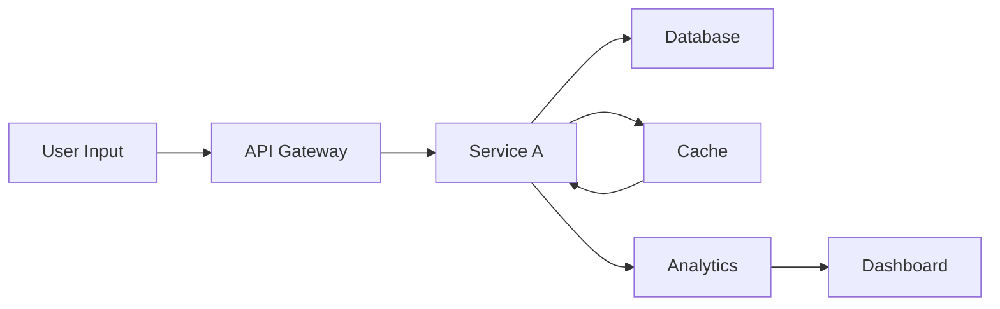
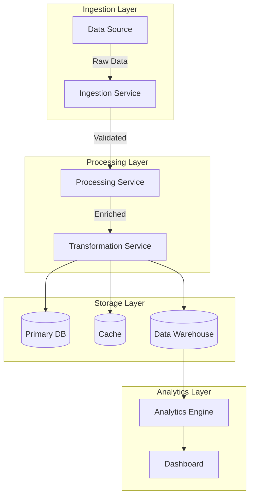

# Data Flow Analyzer

## Overview
Analyze data flow through systems to identify value chains, bottlenecks, and optimization opportunities. Visualizes how data moves from source to destination and where value is added.

## When to Use

```
Performance issues? ──────────────────────┐
                                         │
Designing data pipeline? ─────────────────┤
                                         ├─► Use data-flow-analyzer
Debugging data loss/duplication? ──────────┤
                                         │
Optimizing data architecture? ─────────────┘
```

Use when:
- Diagnosing performance bottlenecks
- Designing new data architectures
- Troubleshooting data consistency issues
- Planning data pipeline optimization
- Understanding system data dependencies
- Compliance requires data lineage documentation

## Core Pattern

### Data Flow Visualization



### Before (Unanalyzed Flow)

```
System: User signup flow
Issues:
- Unknown where data is stored
- Duplicate data across services
- No clear data lineage
- Compliance audit failed
```

### After (Analyzed Flow)

```yaml
Data Flow:
  Step 1: User submits form
    → Validates input (API Gateway)
    → Stores user data (User Service)
    → Sends welcome email (Notification Service)
    → Records analytics event (Analytics Service)

  Data Storage:
    - User data: PostgreSQL (User Service)
    - Session: Redis (Cache)
    - Events: Kafka (Event Bus)

  Value Chain:
    - Email: Engagement (immediate value)
    - Analytics: Insights (future value)
    - Session: Experience (continuous value)

  Optimizations:
    - Add cache for frequently accessed user data
    - Async email sending to improve response time
```

## Implementation

### Data Flow Analysis Steps

1. **Map Data Sources** - Identify all data entry points
2. **Trace Data Paths** - Follow data through the system
3. **Identify Storage** - Document where data persists
4. **Calculate Latency** - Measure end-to-end delay
5. **Find Bottlenecks** - Identify slow components
6. **Optimize** - Apply improvements

### Mermaid Diagram Template


