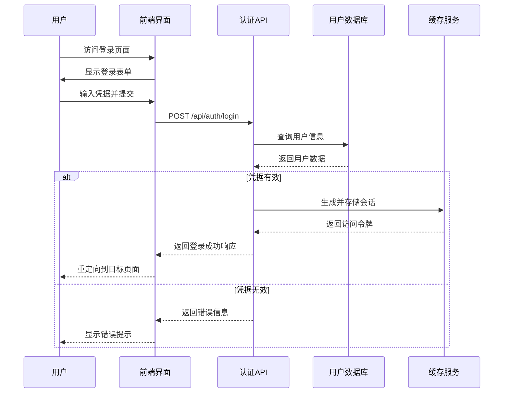
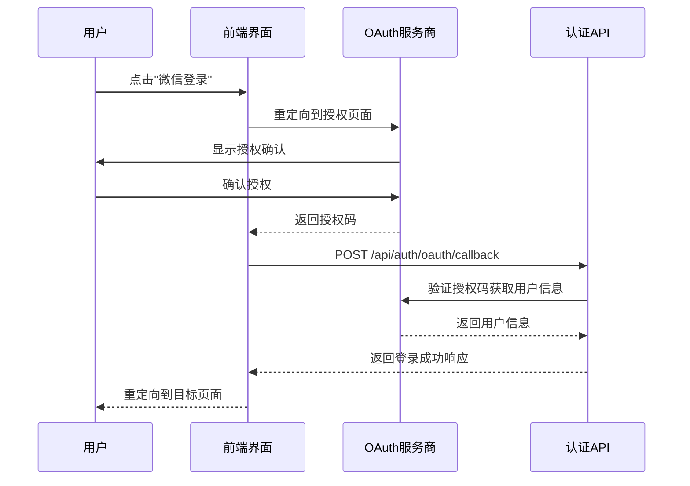
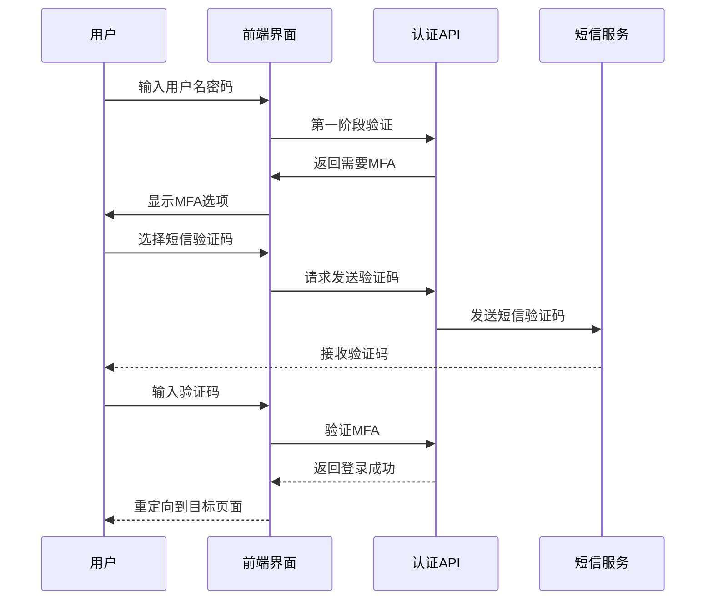

# Requirements to Code Docs

## Overview
Generate comprehensive documentation following industry best practices: from business requirements to use cases to implementation. Creates structured documentation that traces requirements through design to code implementation with traceability matrices.

## When to Use

```
Need project docs? ──────────────┐
                                 │
Requirements to code? ────────────┤
                                 ├─► Use requirements-to-code-docs
Structured workflow? ─────────────┤
                                 │
Traceability needed? ─────────────┘
```

Use when:
- Starting new project with documentation needs
- Converting requirements to technical specifications
- Creating use case documentation
- Generating API documentation from code
- Building traceability matrices
- Maintaining documentation as code evolves
- Need production-ready documentation structure
- Creating developer onboarding materials

Don't use when:
- Simple code comments only
- Quick prototypes without formal documentation
- Existing documentation already covers needs
- Only need API documentation (use Swagger/OpenAPI)

## Core Pattern

### Documentation Structure (Industry Standard)

```
docs/
├── 01-schedule/                  # Project timeline and milestones
│   ├── roadmap.md
│   └── todolist.md
├── 02-requirements/              # Business and technical requirements
│   ├── 01-business.md
│   ├── 02-architecture.md
│   ├── 03-functional.md
│   ├── 04-non_functional.md
│   ├── 05-regulatory.md
│   ├── 06-security.md
│   └── 07-implementation.md
├── 03-usecases/                  # Use case specifications
│   ├── actors/
│   │   ├── roles.md
│   │   ├── subsystems.md
│   │   └── related.md
│   └── usecases/
│       ├── 001-module-management.md
│       ├── 002-feature-management.md
│       └── README.md
├── 04-realize/                   # Implementation documentation
│   ├── 01-code-structure.md
│   ├── 02-coding-standards.md
│   ├── 03-deployment-documentation.md
│   ├── 04-testing-documentation.md
│   ├── 05-frontend-implementation-summary.md
│   ├── api/                      # API documentation
│   └── data-dictionary/          # Database schema documentation
├── 05-prompts/                   # AI prompts for development
└── 06-manual/                    # User manuals and guides
```

### Before (Unstructured Documentation)
```
project/
├── README.md                     # Everything in one file
└── some-notes.txt               # Random notes files
```

### After (Structured Documentation Workflow)
```
project/
├── docs/                         # Comprehensive documentation
│   ├── requirements/             # Traceable from business needs
│   ├── usecases/                 # To user scenarios
│   ├── implementation/           # To technical design
│   └── api/                      # To API specifications
├── code/                         # Code with traceability comments
│   ├── // REQ-001: Business requirement
│   ├── // UC-001: Use case implementation
│   └── // API-001: Endpoint specification
└── traceability/                 # Requirements traceability matrix
```

## Quick Reference

### Documentation Generation Commands

| Command | Description | Output |
|---------|-------------|--------|
| `requirements-to-code-docs init` | Initialize documentation structure | Complete docs directory |
| `requirements-to-code-docs requirement "User authentication"` | Create requirement document | `02-requirements/08-user-auth.md` |
| `requirements-to-code-docs usecase "User login"` | Create use case document | `03-usecases/usecases/011-user-login.md` |
| `requirements-to-code-docs api UserAPI` | Generate API documentation | `04-realize/api/user-api.md` |
| `requirements-to-code-docs traceability` | Generate traceability matrix | `traceability-matrix.md` |
| `requirements-to-code-docs sync` | Sync docs with code | Updated documentation |

### Essential Templates

#### 1. Business Requirement Template
```markdown
# 业务需求文档：用户认证系统

## 1. 项目背景与目标

### 1.1 项目背景
随着应用用户量的增长，现有简单用户名密码认证已无法满足安全性和用户体验需求。需要建立完整的用户认证体系以支持多平台访问和第三方登录。

### 1.2 业务目标
- **增强安全性**：支持多因素认证和密码策略
- **提升用户体验**：提供第三方登录和记住我功能
- **支持业务扩展**：为未来微服务和API访问提供基础
- **合规要求**：满足GDPR和等保三级认证要求

### 1.3 目标用户群体
- **终端用户**：使用应用的各种用户角色
- **管理员**：管理用户账户和权限
- **第三方应用**：通过OAuth访问用户资源
- **审计人员**：审查认证日志和安全事件

## 2. 核心业务价值

### 2.1 安全性提升
- 减少账户被盗风险
- 防止暴力破解攻击
- 支持安全审计和合规

### 2.2 用户体验改进
- 简化注册登录流程
- 支持多种登录方式
- 提供个性化认证体验

### 2.3 技术架构现代化
- 支持微服务架构
- 提供标准化认证接口
- 支持未来技术演进

## 3. 业务功能需求

### 3.1 用户注册 (REQ-AUTH-001)
- 支持邮箱/手机号注册
- 验证码验证机制
- 用户协议确认
- 注册成功欢迎邮件

### 3.2 用户登录 (REQ-AUTH-002)
- 用户名密码登录
- 第三方登录（微信、Google、GitHub）
- 记住我功能
- 登录失败保护

### 3.3 密码管理 (REQ-AUTH-003)
- 密码强度验证
- 密码修改功能
- 密码重置流程
- 密码过期策略

### 3.4 多因素认证 (REQ-AUTH-004)
- 短信验证码
- 邮箱验证码
- 认证器应用（Google Authenticator）
- 生物识别（未来支持）

## 4. 非功能性需求

### 4.1 性能需求
- 登录响应时间 < 2秒（P95）
- 支持1000并发登录
- 认证服务可用性 > 99.9%

### 4.2 安全需求
- 密码加密存储（bcrypt）
- 防止SQL注入和XSS攻击
- 会话安全管理
- 安全审计日志

### 4.3 合规需求
- GDPR数据保护
- 等保三级要求
- 隐私政策遵守
- 数据跨境传输合规

## 5. 成功指标

| 指标 | 目标值 | 测量方法 |
|------|--------|----------|
| 用户注册转化率 | > 80% | 分析注册漏斗 |
| 登录成功率 | > 99% | 监控登录接口 |
| 认证延迟 | < 2秒 | APM监控 |
| 安全事件 | 0次/月 | 安全审计日志 |
| 用户满意度 | > 4.5/5 | 用户反馈调查 |

## 6. 约束条件

### 6.1 技术约束
- 必须使用JWT令牌
- 必须支持OAuth 2.0
- 必须兼容现有用户数据库
- 必须提供RESTful API

### 6.2 资源约束
- 开发周期：4周
- 团队规模：3名开发人员
- 预算限制：$50,000
- 硬件资源：现有服务器基础设施

### 6.3 合规约束
- 必须通过安全审计
- 必须获得合规认证
- 必须保护用户隐私数据
- 必须支持数据导出功能
```

#### 2. Use Case Template
```markdown
# 用户登录用例文档

## 用例概述

### 用例名称
用户登录 (UC-AUTH-002)

### 用例描述
注册用户通过多种方式登录系统，获取访问令牌和会话信息。

### 主要参与者
- **主要参与者**: 注册用户
- **次要参与者**: 系统管理员（查看日志）、第三方认证服务提供商

### 前置条件
1. 用户已完成注册并激活账户
2. 用户知道正确的登录凭据
3. 系统正常运行且认证服务可用

### 后置条件
1. 用户成功登录并获取访问令牌
2. 系统记录登录日志和安全审计信息
3. 用户被重定向到目标页面或首页

## 用例详细说明

### 基本流程



### 备选流程

#### A1: 第三方登录


#### A2: 多因素认证


### 异常流程

#### E1: 账户被锁定
- **触发条件**: 用户连续5次登录失败
- **系统响应**: 返回"账户已锁定，请15分钟后重试"
- **恢复操作**: 自动解锁或联系管理员解锁

#### E2: 网络超时
- **触发条件**: 认证服务响应超时（>10秒）
- **系统响应**: 显示"服务暂时不可用，请稍后重试"
- **恢复操作**: 自动重试或引导用户稍后重试

#### E3: 第三方服务不可用
- **触发条件**: OAuth服务商接口不可用
- **系统响应**: 显示"第三方登录暂时不可用"
- **恢复操作**: 提供备用登录方式或稍后重试

## 功能设计

### 技术实现方案
```go
// internal/services/auth_service.go
type AuthService struct {
    userRepo    UserRepository
    tokenRepo   TokenRepository
    logger      *slog.Logger
    config      *Config
}

func (s *AuthService) Login(ctx context.Context, req LoginRequest) (*LoginResponse, error) {
    // 1. 验证用户凭据
    user, err := s.userRepo.FindByUsername(req.Username)
    if err != nil || !s.validatePassword(user, req.Password) {
        s.logFailedAttempt(ctx, req.Username)
        return nil, ErrInvalidCredentials
    }
    
    // 2. 检查账户状态
    if user.IsLocked() {
        return nil, ErrAccountLocked
    }
    
    // 3. 检查是否需要MFA
    if s.requiresMFA(user) {
        return &LoginResponse{
            RequiresMFA: true,
            MFAMethods:  s.getMFAMethods(user),
        }, nil
    }
    
    // 4. 生成访问令牌
    token, err := s.generateToken(user)
    if err != nil {
        return nil, err
    }
    
    // 5. 记录登录成功
    s.logSuccessfulLogin(ctx, user)
    
    return &LoginResponse{
        AccessToken:  token.AccessToken,
        RefreshToken: token.RefreshToken,
        ExpiresIn:    token.ExpiresIn,
        User:         ToUserDTO(user),
    }, nil
}
```

### 核心功能描述
1. **凭据验证**: 验证用户名密码或第三方令牌
2. **账户状态检查**: 检查账户是否激活、锁定或过期
3. **多因素认证**: 根据配置决定是否触发MFA
4. **令牌生成**: 生成JWT访问令牌和刷新令牌
5. **会话管理**: 创建和管理用户会话
6. **安全审计**: 记录所有登录尝试和结果

### 数据结构设计
```sql
-- 用户表
CREATE TABLE users (
    id UUID PRIMARY KEY DEFAULT gen_random_uuid(),
    username VARCHAR(255) UNIQUE NOT NULL,
    email VARCHAR(255) UNIQUE NOT NULL,
    password_hash VARCHAR(255) NOT NULL,
    is_active BOOLEAN DEFAULT true,
    is_locked BOOLEAN DEFAULT false,
    failed_attempts INTEGER DEFAULT 0,
    locked_until TIMESTAMP,
    mfa_enabled BOOLEAN DEFAULT false,
    mfa_method VARCHAR(50),
    created_at TIMESTAMP DEFAULT NOW(),
    updated_at TIMESTAMP DEFAULT NOW()
);

-- 登录日志表
CREATE TABLE login_logs (
    id UUID PRIMARY KEY DEFAULT gen_random_uuid(),
    user_id UUID REFERENCES users(id),
    ip_address INET,
    user_agent TEXT,
    success BOOLEAN NOT NULL,
    failure_reason VARCHAR(255),
    created_at TIMESTAMP DEFAULT NOW()
);
```

## 异常处理

### 常见异常场景
1. **无效凭据**: 用户名密码不匹配
2. **账户锁定**: 连续登录失败导致账户锁定
3. **MFA失败**: 验证码错误或过期
4. **网络超时**: 认证服务响应超时
5. **第三方服务错误**: OAuth提供商返回错误

### 检测机制
```go
// internal/pkg/errors/auth_errors.go
var (
    ErrInvalidCredentials = NewAuthError("invalid_credentials", "用户名或密码不正确")
    ErrAccountLocked = NewAuthError("account_locked", "账户已被锁定，请15分钟后重试")
    ErrMFARequired = NewAuthError("mfa_required", "需要多因素认证")
    ErrMFAFailed = NewAuthError("mfa_failed", "验证码错误或已过期")
    ErrOAuthFailed = NewAuthError("oauth_failed", "第三方登录失败")
)

type AuthError struct {
    Code    string `json:"code"`
    Message string `json:"message"`
    Details string `json:"details,omitempty"`
}
```

### 处理方案
1. **用户友好错误信息**: 不暴露系统内部细节
2. **渐进式披露**: 逐步提供更多信息帮助用户解决问题
3. **安全防护**: 防止信息泄露和攻击探测
4. **监控告警**: 异常模式触发安全告警

## 性能考虑

### 优化策略
1. **缓存用户信息**: 频繁访问的用户信息缓存5分钟
2. **异步日志记录**: 登录日志异步写入防止阻塞
3. **连接池管理**: 数据库和Redis连接池优化
4. **CDN加速**: 静态资源和第三方脚本CDN加速

### 扩展性设计
1. **水平扩展**: 无状态设计支持多实例部署
2. **读写分离**: 登录日志写入独立数据库
3. **地理分布**: 支持多地部署降低延迟
4. **自动扩缩容**: 基于流量自动调整实例数量

## 安全考虑

### 安全防护措施
1. **密码安全**: bcrypt哈希加盐存储
2. **会话安全**: JWT签名验证，短期令牌
3. **速率限制**: IP和用户级别的登录尝试限制
4. **输入验证**: 防止SQL注入和XSS攻击

### 权限控制机制
1. **最小权限原则**: 只授予必要权限
2. **访问控制列表**: 基于角色的访问控制
3. **审计日志**: 记录所有敏感操作
4. **安全扫描**: 定期进行安全漏洞扫描

## 扩展功能

### 未来扩展可能性
1. **生物识别**: 支持指纹和面部识别
2. **无密码认证**: 基于邮件的魔法链接登录
3. **单点登录**: 企业SSO集成
4. **风险分析**: 基于行为的风险评分

### 集成支持能力
1. **WebAuthn**: 支持Web认证API
2. **SAML 2.0**: 企业身份提供商集成
3. **OpenID Connect**: 标准身份验证协议
4. **自定义适配器**: 可插拔的认证提供商
```

#### 3. API Documentation Template
```markdown
# 用户认证API文档

## 概述
用户认证API提供用户注册、登录、登出和令牌管理功能。

## 基础信息
- **Base URL**: `https://api.example.com/api/v1`
- **认证方式**: Bearer Token (JWT)
- **数据格式**: JSON
- **版本**: v1.0.0

## 错误处理
所有错误响应使用统一格式：
```json
{
  "success": false,
  "error": {
    "code": "error_code",
    "message": "Human readable message",
    "details": "Additional details (optional)"
  }
}
```

## 端点列表

### 用户登录

**POST** `/auth/login`

登录用户并获取访问令牌。

**请求头**:
```
Content-Type: application/json
```

**请求体**:
```json
{
  "username": "user@example.com",
  "password": "secure_password123",
  "remember_me": false
}
```

**响应**:
- **200 OK**: 登录成功
```json
{
  "success": true,
  "data": {
    "access_token": "eyJhbGciOiJIUzI1NiIsInR5cCI6IkpXVCJ9...",
    "refresh_token": "eyJhbGciOiJIUzI1NiIsInR5cCI6IkpXVCJ9...",
    "expires_in": 3600,
    "token_type": "Bearer",
    "user": {
      "id": "550e8400-e29b-41d4-a716-446655440000",
      "username": "user@example.com",
      "email": "user@example.com",
      "name": "John Doe",
      "roles": ["user"]
    }
  }
}
```

- **400 Bad Request**: 请求参数错误
- **401 Unauthorized**: 凭据无效
- **423 Locked**: 账户被锁定
- **429 Too Many Requests**: 请求过于频繁

**对应代码**:
```go
// internal/interfaces/handlers/auth_handler.go:45
// @Summary 用户登录
// @Description 使用用户名密码登录获取访问令牌
// @Tags auth
// @Accept json
// @Produce json
// @Param request body LoginRequest true "登录请求"
// @Success 200 {object} LoginResponse
// @Failure 400 {object} response.Error
// @Failure 401 {object} response.Error
// @Router /api/v1/auth/login [post]
func (h *AuthHandler) Login(c *fiber.Ctx) error {
    // Implementation...
}
```

### 刷新令牌

**POST** `/auth/refresh`

使用刷新令牌获取新的访问令牌。

**请求头**:
```
Authorization: Bearer {refresh_token}
```

**响应**:
- **200 OK**: 令牌刷新成功
```json
{
  "success": true,
  "data": {
    "access_token": "eyJhbGciOiJIUzI1NiIsInR5cCI6IkpXVCJ9...",
    "refresh_token": "eyJhbGciOiJIUzI1NiIsInR5cCI6IkpXVCJ9...",
    "expires_in": 3600,
    "token_type": "Bearer"
  }
}
```

- **401 Unauthorized**: 刷新令牌无效或过期

### 用户登出

**POST** `/auth/logout`

登出用户并废止当前会话。

**请求头**:
```
Authorization: Bearer {access_token}
```

**响应**:
- **200 OK**: 登出成功
```json
{
  "success": true,
  "data": {
    "message": "Successfully logged out"
  }
}
```

## 数据模型

### LoginRequest
```typescript
interface LoginRequest {
  /** 用户名或邮箱地址 */
  username: string;
  /** 用户密码 */
  password: string;
  /** 记住我选项 */
  remember_me?: boolean;
}
```

### LoginResponse
```typescript
interface LoginResponse {
  /** 访问令牌 */
  access_token: string;
  /** 刷新令牌 */
  refresh_token: string;
  /** 令牌过期时间（秒） */
  expires_in: number;
  /** 令牌类型 */
  token_type: string;
  /** 用户信息 */
  user: UserDTO;
}

interface UserDTO {
  id: string;
  username: string;
  email: string;
  name: string;
  roles: string[];
}
```

## 使用示例

### JavaScript (Fetch)
```javascript
async function login(username, password) {
  const response = await fetch('https://api.example.com/api/v1/auth/login', {
    method: 'POST',
    headers: {
      'Content-Type': 'application/json',
    },
    body: JSON.stringify({
      username,
      password,
      remember_me: false
    })
  });
  
  if (!response.ok) {
    const error = await response.json();
    throw new Error(error.error.message);
  }
  
  return await response.json();
}
```

### Go
```go
func Login(client *http.Client, username, password string) (*LoginResponse, error) {
    reqBody := LoginRequest{
        Username:   username,
        Password:   password,
        RememberMe: false,
    }
    
    body, _ := json.Marshal(reqBody)
    
    req, _ := http.NewRequest("POST", "https://api.example.com/api/v1/auth/login", bytes.NewReader(body))
    req.Header.Set("Content-Type", "application/json")
    
    resp, err := client.Do(req)
    if err != nil {
        return nil, err
    }
    defer resp.Body.Close()
    
    if resp.StatusCode != http.StatusOK {
        var errResp ErrorResponse
        json.NewDecoder(resp.Body).Decode(&errResp)
        return nil, fmt.Errorf("login failed: %s", errResp.Error.Message)
    }
    
    var loginResp LoginResponse
    json.NewDecoder(resp.Body).Decode(&loginResp)
    
    return &loginResp, nil
}
```

## 安全注意事项

1. **令牌安全**: 访问令牌应存储在安全的地方（HttpOnly cookie或安全存储）
2. **传输安全**: 始终使用HTTPS传输认证数据
3. **密码策略**: 实施强密码策略和定期更换要求
4. **监控告警**: 监控异常登录尝试和潜在攻击

## 版本历史

| 版本 | 日期 | 变更说明 |
|------|------|----------|
| v1.0.0 | 2024-01-15 | 初始版本 |
| v1.1.0 | 2024-02-10 | 添加多因素认证支持 |
| v1.2.0 | 2024-03-05 | 添加第三方登录支持 |

## 对应需求
- REQ-AUTH-002: 用户登录功能
- REQ-AUTH-004: 多因素认证支持
```

## Implementation

### Documentation Generation Workflow

```bash
# Initialize documentation structure
requirements-to-code-docs init \
  --project="MyApp" \
  --structure="production-ready"

# Create business requirement
requirements-to-code-docs requirement "User Management System" \
  --category="functional" \
  --priority="high" \
  --stakeholders="product,engineering,security"

# Generate use cases from requirement
requirements-to-code-docs usecase-from-req "REQ-USER-001" \
  --output="03-usecases/usecases/001-user-management.md"

# Generate API documentation from code
requirements-to-code-docs api-from-code \
  --source="./backend/internal/interfaces/handlers" \
  --output="./docs/04-realize/api"

# Create traceability matrix
requirements-to-code-docs traceability \
  --requirements="./docs/02-requirements" \
  --usecases="./docs/03-usecases" \
  --code="./backend,./frontend" \
  --output="./docs/traceability-matrix.md"

# Sync documentation with current code
requirements-to-code-docs sync \
  --auto-update \
  --validate-links
```

### Traceability Matrix Template

```markdown
# 需求跟踪矩阵

## 概述
本矩阵跟踪业务需求到用例到代码实现的完整链路。

## 矩阵结构

| 需求ID | 需求描述 | 用例ID | 用例描述 | 代码文件 | 代码行数 | 测试用例 | 状态 |
|--------|----------|--------|----------|----------|----------|----------|------|
| REQ-AUTH-001 | 用户注册功能 | UC-AUTH-001 | 用户注册用例 | `backend/internal/interfaces/handlers/auth_handler.go` | 45-89 | `TestAuthHandler_Register` | ✅ 完成 |
| REQ-AUTH-001 | 用户注册功能 | UC-AUTH-001 | 用户注册用例 | `backend/internal/services/auth_service.go` | 120-185 | `TestAuthService_Register` | ✅ 完成 |
| REQ-AUTH-001 | 用户注册功能 | UC-AUTH-001 | 用户注册用例 | `frontend/src/pages/RegisterPage.vue` | 45-120 | `RegisterPage.spec.ts` | ✅ 完成 |
| REQ-AUTH-002 | 用户登录功能 | UC-AUTH-002 | 用户登录用例 | `backend/internal/interfaces/handlers/auth_handler.go` | 90-150 | `TestAuthHandler_Login` | ✅ 完成 |
| REQ-AUTH-002 | 用户登录功能 | UC-AUTH-002 | 用户登录用例 | `frontend/src/pages/LoginPage.vue` | 35-95 | `LoginPage.spec.ts` | ✅ 完成 |
| REQ-AUTH-003 | 密码管理功能 | UC-AUTH-003 | 密码重置用例 | `backend/internal/interfaces/handlers/password_handler.go` | 25-80 | `TestPasswordHandler_Reset` | 🟡 开发中 |
| REQ-AUTH-004 | 多因素认证 | UC-AUTH-004 | MFA设置用例 | `backend/internal/interfaces/handlers/mfa_handler.go` | - | - | 🟠 待开始 |

## 覆盖率统计

| 类别 | 总数 | 已完成 | 进行中 | 未开始 | 覆盖率 |
|------|------|--------|--------|--------|--------|
| 业务需求 | 15 | 8 | 4 | 3 | 53% |
| 用例 | 25 | 12 | 6 | 7 | 48% |
| 代码文件 | 45 | 25 | 10 | 10 | 56% |
| 测试用例 | 60 | 35 | 12 | 13 | 58% |

## 质量指标

### 文档质量
- **需求完整性**: 85%
- **用例详细度**: 78%
- **API文档覆盖**: 92%
- **代码注释率**: 65%

### 实现质量
- **需求实现率**: 80%
- **测试覆盖率**: 75%
- **代码规范符合度**: 90%
- **安全要求满足度**: 85%

## 风险跟踪

| 风险项 | 影响 | 可能性 | 缓解措施 | 责任人 | 状态 |
|--------|------|--------|----------|--------|------|
| 需求变更频繁 | 高 | 中 | 建立变更控制流程 | 产品经理 | 🟡 监控中 |
| 技术债务累积 | 中 | 高 | 定期重构和代码审查 | 技术主管 | 🟡 处理中 |
| 文档与代码不同步 | 中 | 高 | 自动化文档同步 | 开发团队 | 🟢 已解决 |
| 安全漏洞风险 | 高 | 低 | 定期安全扫描和渗透测试 | 安全团队 | 🟡 监控中 |

## 更新记录

| 日期 | 更新内容 | 更新人 |
|------|----------|--------|
| 2024-01-15 | 初始矩阵创建 | 张三 |
| 2024-01-20 | 添加用户认证模块跟踪 | 李四 |
| 2024-01-25 | 更新实现状态和覆盖率 | 王五 |
| 2024-02-01 | 添加质量指标和风险跟踪 | 张三 |
```

## Common Mistakes

| Mistake | Why It's Wrong | Fix |
|---------|---------------|-----|
| Documentation not updated with code changes | Misleading documentation, wasted effort | Automate doc sync, code comments |
| Requirements not traceable to implementation | Can't verify feature completeness | Use traceability matrix |
| Use cases too vague | Ambiguous implementation guidance | Detail acceptance criteria |
| API docs not generated from code | Documentation drift from actual API | Use Swagger/OpenAPI generation |
| No version control for documents | Can't track changes or roll back | Store docs in git |
| Missing non-functional requirements | Performance, security issues later | Include all requirement types |
| Documentation not accessible | Team can't find needed information | Centralize in docs/ directory |

### Red Flags

- Requirements without corresponding use cases
- Use cases without implementation code
- Code without traceability comments
- API documentation manually written
- No documentation review process
- Missing changelog for documents
- Documents not in version control

## Integration with Development Workflow

This skill works with:
- `go-backend-scaffolder` for code generation with traceability
- `vue-quasar-scaffolder` for frontend component documentation
- `fullstack-project-setup` for project documentation structure
- `go-vue-fullstack-workflow` for integrated documentation workflow

### Example Documentation Workflow

```bash
# 1. Initialize project with documentation
fullstack-project-setup create myapp --with-docs

# 2. Create business requirements
requirements-to-code-docs requirement "User Authentication" \
  --template="security-critical"

# 3. Generate use cases
requirements-to-code-docs usecases-from-reqs \
  --input="./docs/02-requirements" \
  --output="./docs/03-usecases"

# 4. Generate code with traceability
go-backend-scaffolder generate crud User \
  --requirements="REQ-AUTH-001,REQ-AUTH-002" \
  --usecases="UC-AUTH-001,UC-AUTH-002"

# 5. Generate API documentation
requirements-to-code-docs api-from-code \
  --update-existing \
  --format="markdown+openapi"

# 6. Create traceability report
requirements-to-code-docs traceability \
  --report="coverage,quality,risks" \
  --export="html,pdf"

# 7. Set up documentation CI
requirements-to-code-docs configure-ci \
  --validate-on-pr \
  --sync-on-merge
```

## Real-World Impact

**Before (Unstructured Documentation):**
- Requirements in emails and chat messages
- Use cases not documented
- API docs outdated or missing
- No traceability between requirements and code
- Hard to onboard new team members
- Compliance audits difficult

**After (With Structured Workflow):**
- Requirements in structured documents
- Detailed use cases with acceptance criteria
- Auto-generated API documentation
- Complete traceability matrix
- Easy onboarding with comprehensive docs
- Simplified compliance audits

**Outcome:** Better requirements management, higher code quality, easier maintenance, faster onboarding, compliance readiness.