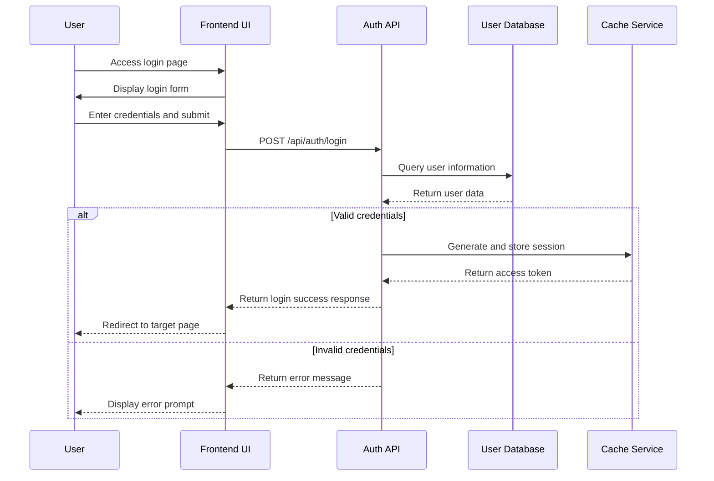
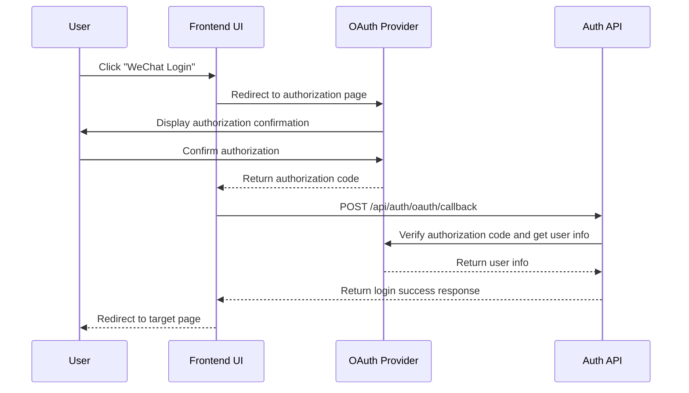
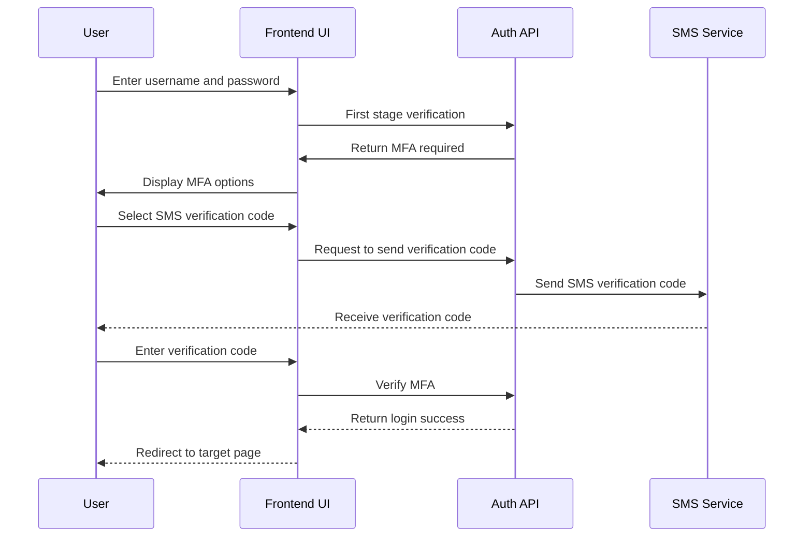

# Requirements to Code Docs

## Overview
Generate comprehensive documentation following industry best practices: from business requirements to use cases to implementation. Creates structured documentation that traces requirements through design to code implementation with traceability matrices. Supports the 7-category requirement classification system with cross-category relationship mapping.

## When to Use

```
Need project docs? ──────────────┐
                                 │
Requirements to code? ────────────┤
                                 ├─► Use requirements-to-code-docs
Structured workflow? ─────────────┤
                                 │
Traceability needed? ─────────────┘
```

Use when:
- Starting new project with documentation needs
- Converting requirements to technical specifications
- Creating use case documentation
- Generating API documentation from code
- Building traceability matrices
- Maintaining documentation as code evolves
- Need production-ready documentation structure
- Creating developer onboarding materials
- Documenting requirements from [requirement-classifier](file:///d:/repos/aether-go/skills/skills/requirement-classifier/SKILL.md)
- Creating use case docs from [usecase-designer](file:///d:/repos/aether-go/skills/skills/usecase-designer/SKILL.md)

Don't use when:
- Simple code comments only
- Quick prototypes without formal documentation
- Existing documentation already covers needs
- Only need API documentation (use Swagger/OpenAPI)

## Core Pattern

### Seven-Category Documentation Structure

```
docs/
├── 01-schedule/                  # Project timeline and milestones
│   ├── roadmap.md
│   └── todolist.md
├── 02-requirements/              # Seven-category requirements
│   ├── 01-business-requirements.md       # REQ-BUS: Business Requirements
│   ├── 02-architecture-requirements.md   # REQ-ARCH: Architecture Requirements
│   ├── 03-functional-requirements.md     # REQ-FUNC: Functional Requirements
│   ├── 04-non-functional-requirements.md # REQ-NFR: Non-Functional Requirements
│   ├── 05-compliance-requirements.md     # REQ-COMP: Compliance Requirements
│   ├── 06-security-requirements.md       # REQ-SEC: Security Requirements
│   ├── 07-scalability-requirements.md    # REQ-SCAL: Scalability Requirements
│   └── cross-category-relations.md       # Cross-Category Relationship Mapping
├── 03-usecases/                  # Use case specifications
│   ├── actors/
│   │   ├── roles.md
│   │   ├── subsystems.md
│   │   └── related.md
│   └── usecases/
│       ├── UC-BUS-001-business-process.md
│       ├── UC-FUNC-001-feature-implementation.md
│       ├── UC-SEC-001-security-operation.md
│       └── README.md
├── 04-realize/                   # Implementation documentation
│   ├── 01-code-structure.md
│   ├── 02-coding-standards.md
│   ├── 03-deployment-documentation.md
│   ├── 04-testing-documentation.md
│   ├── 05-frontend-implementation-summary.md
│   ├── api/                      # API documentation
│   └── data-dictionary/          # Database schema documentation
├── 05-traceability/              # Three-layer traceability
│   ├── requirement-usecase-matrix.md
│   ├── usecase-implementation-matrix.md
│   ├── requirement-implementation-matrix.md
│   └── coverage-report.md
├── 06-prompts/                   # AI prompts for development
└── 07-manual/                    # User manuals and guides
```

### Seven-Category Requirement Flow

```
┌─────────────────────────────────────────────────────────────────────────────┐
│                         REQUIREMENT COLLECTION                               │
│  [business-requirements-collector] → 7-Category Requirements                 │
└─────────────────────────────────────────────────────────────────────────────┘
                                    │
                                    ▼
┌─────────────────────────────────────────────────────────────────────────────┐
│                         REQUIREMENT CLASSIFICATION                           │
│  [requirement-classifier] → Classified Requirements with Relations           │
└─────────────────────────────────────────────────────────────────────────────┘
                                    │
                                    ▼
┌─────────────────────────────────────────────────────────────────────────────┐
│                         USE CASE DESIGN                                      │
│  [usecase-designer] → Use Cases with Traceability                            │
└─────────────────────────────────────────────────────────────────────────────┘
                                    │
                                    ▼
┌─────────────────────────────────────────────────────────────────────────────┐
│                         IMPLEMENTATION                                       │
│  Code with @requirement and @usecase annotations                             │
└─────────────────────────────────────────────────────────────────────────────┘
                                    │
                                    ▼
┌─────────────────────────────────────────────────────────────────────────────┐
│                         TRACEABILITY                                         │
│  [requirement-implementation-tracer] → Three-Layer Traceability Matrix       │
└─────────────────────────────────────────────────────────────────────────────┘
```

### Before (Unstructured Documentation)
```
project/
├── README.md                     # Everything in one file
└── some-notes.txt               # Random notes files
```

### After (Structured Documentation with 7-Category Support)
```
project/
├── docs/                         # Comprehensive documentation
│   ├── 02-requirements/          # 7-category requirements
│   │   ├── 01-business-requirements.md
│   │   ├── 02-architecture-requirements.md
│   │   ├── 03-functional-requirements.md
│   │   ├── 04-non-functional-requirements.md
│   │   ├── 05-compliance-requirements.md
│   │   ├── 06-security-requirements.md
│   │   ├── 07-scalability-requirements.md
│   │   └── cross-category-relations.md
│   ├── 03-usecases/              # Use cases with traceability
│   ├── 04-realize/               # Implementation docs
│   └── 05-traceability/          # Traceability matrices
├── code/                         # Code with traceability comments
│   ├── // @requirement REQ-FUNC-001
│   ├── // @usecase UC-FUNC-001
│   └── // @acceptance AC-FUNC-001-1
└── traceability/                 # Requirements traceability matrix
```

## Quick Reference

### Seven-Category Documentation Commands

| Command | Description | Output |
|---------|-------------|--------|
| `requirements-to-code-docs init` | Initialize 7-category documentation structure | Complete docs directory |
| `requirements-to-code-docs requirement --category business "User auth"` | Create business requirement | `02-requirements/01-business-requirements.md` |
| `requirements-to-code-docs requirement --category architecture "Microservices"` | Create architecture requirement | `02-requirements/02-architecture-requirements.md` |
| `requirements-to-code-docs requirement --category functional "User login"` | Create functional requirement | `02-requirements/03-functional-requirements.md` |
| `requirements-to-code-docs requirement --category nfr "Performance"` | Create NFR requirement | `02-requirements/04-non-functional-requirements.md` |
| `requirements-to-code-docs requirement --category compliance "GDPR"` | Create compliance requirement | `02-requirements/05-compliance-requirements.md` |
| `requirements-to-code-docs requirement --category security "Auth"` | Create security requirement | `02-requirements/06-security-requirements.md` |
| `requirements-to-code-docs requirement --category scalability "Scale"` | Create scalability requirement | `02-requirements/07-scalability-requirements.md` |
| `requirements-to-code-docs usecase "User login"` | Create use case document | `03-usecases/usecases/UC-FUNC-001-user-login.md` |
| `requirements-to-code-docs api UserAPI` | Generate API documentation | `04-realize/api/user-api.md` |
| `requirements-to-code-docs traceability` | Generate three-layer traceability matrix | `05-traceability/coverage-report.md` |
| `requirements-to-code-docs sync` | Sync docs with code | Updated documentation |

### Seven-Category Requirement ID Prefixes

| Category | ID Prefix | Document | Description |
|----------|-----------|----------|-------------|
| **01-Business Requirements** | REQ-BUS | 01-business-requirements.md | Business goals, KPIs, stakeholders |
| **02-Architecture Requirements** | REQ-ARCH | 02-architecture-requirements.md | Architecture decisions, patterns |
| **03-Functional Requirements** | REQ-FUNC | 03-functional-requirements.md | Features, behaviors, user stories |
| **04-Non-Functional Requirements** | REQ-NFR | 04-non-functional-requirements.md | Performance, reliability, usability |
| **05-Compliance Requirements** | REQ-COMP | 05-compliance-requirements.md | Regulatory, legal requirements |
| **06-Security Requirements** | REQ-SEC | 06-security-requirements.md | Security controls, threat models |
| **07-Scalability Requirements** | REQ-SCAL | 07-scalability-requirements.md | Scalability, capacity planning |

### Cross-Category Relation Types

| Relation | Description | Example |
|----------|-------------|---------|
| **drives** | One requirement drives another | REQ-BUS drives REQ-FUNC |
| **constrains** | One constrains another | REQ-ARCH constrains REQ-FUNC |
| **depends_on** | Dependency relationship | REQ-FUNC depends_on REQ-SEC |
| **conflicts_with** | Conflicting objectives | REQ-SEC conflicts_with REQ-SCAL |
| **validates** | Validation relationship | REQ-COMP validates REQ-SEC |
| **supports** | Support relationship | REQ-NFR supports REQ-BUS |
| **enables** | Enablement relationship | REQ-ARCH enables REQ-SCAL |
```markdown
# Business Requirement Document: User Authentication System

## 1. Project Background and Objectives

### 1.1 Project Background
With the growth of application users, the existing simple username/password authentication can no longer meet security and user experience requirements. A complete user authentication system needs to be established to support multi-platform access and third-party login.

### 1.2 Business Objectives
- **Enhanced Security**: Support multi-factor authentication and password policies
- **Improved User Experience**: Provide third-party login and remember-me functionality
- **Business Expansion Support**: Provide foundation for future microservices and API access
- **Compliance Requirements**: Meet GDPR and Level 3 protection certification requirements

### 1.3 Target User Groups
- **End Users**: Various user roles using the application
- **Administrators**: Manage user accounts and permissions
- **Third-party Applications**: Access user resources via OAuth
- **Auditors**: Review authentication logs and security events

## 2. Core Business Value

### 2.1 Security Enhancement
- Reduce account theft risk
- Prevent brute force attacks
- Support security audit and compliance

### 2.2 User Experience Improvement
- Simplify registration and login process
- Support multiple login methods
- Provide personalized authentication experience

### 2.3 Technical Architecture Modernization
- Support microservices architecture
- Provide standardized authentication interfaces
- Support future technology evolution

## 3. Business Functional Requirements

### 3.1 User Registration (REQ-AUTH-001)
- Support email/phone registration
- Verification code mechanism
- User agreement confirmation
- Welcome email on successful registration

### 3.2 User Login (REQ-AUTH-002)
- Username/password login
- Third-party login (WeChat, Google, GitHub)
- Remember me functionality
- Login failure protection

### 3.3 Password Management (REQ-AUTH-003)
- Password strength validation
- Password change functionality
- Password reset process
- Password expiration policy

### 3.4 Multi-Factor Authentication (REQ-AUTH-004)
- SMS verification code
- Email verification code
- Authenticator app (Google Authenticator)
- Biometric authentication (future support)

## 4. Non-Functional Requirements

### 4.1 Performance Requirements
- Login response time < 2 seconds (P95)
- Support 1000 concurrent logins
- Authentication service availability > 99.9%

### 4.2 Security Requirements
- Password encrypted storage (bcrypt)
- Prevent SQL injection and XSS attacks
- Session security management
- Security audit logs

### 4.3 Compliance Requirements
- GDPR data protection
- Level 3 protection requirements
- Privacy policy compliance
- Cross-border data transfer compliance

## 5. Success Metrics

| Metric | Target Value | Measurement Method |
|--------|--------------|-------------------|
| User registration conversion rate | > 80% | Analyze registration funnel |
| Login success rate | > 99% | Monitor login API |
| Authentication latency | < 2 seconds | APM monitoring |
| Security incidents | 0/month | Security audit logs |
| User satisfaction | > 4.5/5 | User feedback survey |

## 6. Constraints

### 6.1 Technical Constraints
- Must use JWT tokens
- Must support OAuth 2.0
- Must be compatible with existing user database
- Must provide RESTful API

### 6.2 Resource Constraints
- Development cycle: 4 weeks
- Team size: 3 developers
- Budget limit: $50,000
- Hardware resources: Existing server infrastructure

### 6.3 Compliance Constraints
- Must pass security audit
- Must obtain compliance certification
- Must protect user privacy data
- Must support data export functionality
```

#### 2. Use Case Template
```markdown
# User Login Use Case Document

## Use Case Overview

### Use Case Name
User Login (UC-AUTH-002)

### Use Case Description
Registered users log in to the system through various methods to obtain access tokens and session information.

### Primary Actors
- **Primary Actor**: Registered User
- **Secondary Actors**: System Administrator (view logs), Third-party Authentication Service Providers

### Preconditions
1. User has completed registration and activated account
2. User knows correct login credentials
3. System is running normally and authentication service is available

### Postconditions
1. User successfully logs in and obtains access token
2. System records login logs and security audit information
3. User is redirected to target page or homepage

## Use Case Detailed Description

### Basic Flow



### Alternative Flows

#### A1: Third-party Login


#### A2: Multi-Factor Authentication


### Exception Flows

#### E1: Account Locked
- **Trigger Condition**: User fails to login 5 consecutive times
- **System Response**: Return "Account locked, please try again in 15 minutes"
- **Recovery Action**: Auto-unlock or contact administrator to unlock

#### E2: Network Timeout
- **Trigger Condition**: Authentication service response timeout (>10 seconds)
- **System Response**: Display "Service temporarily unavailable, please try again later"
- **Recovery Action**: Auto-retry or guide user to retry later

#### E3: Third-party Service Unavailable
- **Trigger Condition**: OAuth provider interface unavailable
- **System Response**: Display "Third-party login temporarily unavailable"
- **Recovery Action**: Provide alternative login methods or retry later

## Functional Design

### Technical Implementation
```go
// internal/services/auth_service.go
type AuthService struct {
    userRepo    UserRepository
    tokenRepo   TokenRepository
    logger      *slog.Logger
    config      *Config
}

func (s *AuthService) Login(ctx context.Context, req LoginRequest) (*LoginResponse, error) {
    // 1. Validate user credentials
    user, err := s.userRepo.FindByUsername(req.Username)
    if err != nil || !s.validatePassword(user, req.Password) {
        s.logFailedAttempt(ctx, req.Username)
        return nil, ErrInvalidCredentials
    }
    
    // 2. Check account status
    if user.IsLocked() {
        return nil, ErrAccountLocked
    }
    
    // 3. Check if MFA is required
    if s.requiresMFA(user) {
        return &LoginResponse{
            RequiresMFA: true,
            MFAMethods:  s.getMFAMethods(user),
        }, nil
    }
    
    // 4. Generate access token
    token, err := s.generateToken(user)
    if err != nil {
        return nil, err
    }
    
    // 5. Log successful login
    s.logSuccessfulLogin(ctx, user)
    
    return &LoginResponse{
        AccessToken:  token.AccessToken,
        RefreshToken: token.RefreshToken,
        ExpiresIn:    token.ExpiresIn,
        User:         ToUserDTO(user),
    }, nil
}
```

### Core Functionality Description
1. **Credential Validation**: Validate username/password or third-party tokens
2. **Account Status Check**: Check if account is active, locked, or expired
3. **Multi-Factor Authentication**: Determine whether to trigger MFA based on configuration
4. **Token Generation**: Generate JWT access token and refresh token
5. **Session Management**: Create and manage user sessions
6. **Security Audit**: Record all login attempts and results

### Data Structure Design
```sql
-- Users table
CREATE TABLE users (
    id UUID PRIMARY KEY DEFAULT gen_random_uuid(),
    username VARCHAR(255) UNIQUE NOT NULL,
    email VARCHAR(255) UNIQUE NOT NULL,
    password_hash VARCHAR(255) NOT NULL,
    is_active BOOLEAN DEFAULT true,
    is_locked BOOLEAN DEFAULT false,
    failed_attempts INTEGER DEFAULT 0,
    locked_until TIMESTAMP,
    mfa_enabled BOOLEAN DEFAULT false,
    mfa_method VARCHAR(50),
    created_at TIMESTAMP DEFAULT NOW(),
    updated_at TIMESTAMP DEFAULT NOW()
);

-- Login logs table
CREATE TABLE login_logs (
    id UUID PRIMARY KEY DEFAULT gen_random_uuid(),
    user_id UUID REFERENCES users(id),
    ip_address INET,
    user_agent TEXT,
    success BOOLEAN NOT NULL,
    failure_reason VARCHAR(255),
    created_at TIMESTAMP DEFAULT NOW()
);
```

## Exception Handling

### Common Exception Scenarios
1. **Invalid Credentials**: Username/password mismatch
2. **Account Locked**: Consecutive login failures cause account lock
3. **MFA Failure**: Verification code error or expired
4. **Network Timeout**: Authentication service response timeout
5. **Third-party Service Error**: OAuth provider returns error

### Detection Mechanism
```go
// internal/pkg/errors/auth_errors.go
var (
    ErrInvalidCredentials = NewAuthError("invalid_credentials", "Username or password is incorrect")
    ErrAccountLocked = NewAuthError("account_locked", "Account has been locked, please try again in 15 minutes")
    ErrMFARequired = NewAuthError("mfa_required", "Multi-factor authentication required")
    ErrMFAFailed = NewAuthError("mfa_failed", "Verification code is incorrect or expired")
    ErrOAuthFailed = NewAuthError("oauth_failed", "Third-party login failed")
)

type AuthError struct {
    Code    string `json:"code"`
    Message string `json:"message"`
    Details string `json:"details,omitempty"`
}
```

### Handling Solutions
1. **User-friendly Error Messages**: Do not expose internal system details
2. **Progressive Disclosure**: Gradually provide more information to help users solve problems
3. **Security Protection**: Prevent information leakage and attack probing
4. **Monitoring Alerts**: Abnormal patterns trigger security alerts

## Performance Considerations

### Optimization Strategies
1. **Cache User Information**: Frequently accessed user information cached for 5 minutes
2. **Asynchronous Logging**: Login logs written asynchronously to prevent blocking
3. **Connection Pool Management**: Database and Redis connection pool optimization
4. **CDN Acceleration**: Static resources and third-party scripts CDN acceleration

### Scalability Design
1. **Horizontal Scaling**: Stateless design supports multi-instance deployment
2. **Read-Write Separation**: Login logs written to separate database
3. **Geographic Distribution**: Support multi-region deployment to reduce latency
4. **Auto-scaling**: Automatically adjust instance count based on traffic

## Security Considerations

### Security Protection Measures
1. **Password Security**: bcrypt hashing with salt storage
2. **Session Security**: JWT signature verification, short-term tokens
3. **Rate Limiting**: IP and user-level login attempt limits
4. **Input Validation**: Prevent SQL injection and XSS attacks

### Permission Control Mechanism
1. **Principle of Least Privilege**: Grant only necessary permissions
2. **Access Control List**: Role-based access control
3. **Audit Logs**: Record all sensitive operations
4. **Security Scanning**: Regular security vulnerability scanning

## Extended Features

### Future Extension Possibilities
1. **Biometric Authentication**: Support fingerprint and facial recognition
2. **Passwordless Authentication**: Email-based magic link login
3. **Single Sign-On**: Enterprise SSO integration
4. **Risk Analysis**: Behavior-based risk scoring

### Integration Support Capabilities
1. **WebAuthn**: Support Web Authentication API
2. **SAML 2.0**: Enterprise identity provider integration
3. **OpenID Connect**: Standard authentication protocol
4. **Custom Adapters**: Pluggable authentication providers
```

#### 3. API Documentation Template
```markdown
# User Authentication API Documentation

## Overview
The User Authentication API provides user registration, login, logout, and token management functionality.

## Basic Information
- **Base URL**: `https://api.example.com/api/v1`
- **Authentication Method**: Bearer Token (JWT)
- **Data Format**: JSON
- **Version**: v1.0.0

## Error Handling
All error responses use a unified format:
```json
{
  "success": false,
  "error": {
    "code": "error_code",
    "message": "Human readable message",
    "details": "Additional details (optional)"
  }
}
```

## Endpoint List

### User Login

**POST** `/auth/login`

Log in user and get access token.

**Request Headers**:
```
Content-Type: application/json
```

**Request Body**:
```json
{
  "username": "user@example.com",
  "password": "secure_password123",
  "remember_me": false
}
```

**Response**:
- **200 OK**: Login successful
```json
{
  "success": true,
  "data": {
    "access_token": "eyJhbGciOiJIUzI1NiIsInR5cCI6IkpXVCJ9...",
    "refresh_token": "eyJhbGciOiJIUzI1NiIsInR5cCI6IkpXVCJ9...",
    "expires_in": 3600,
    "token_type": "Bearer",
    "user": {
      "id": "550e8400-e29b-41d4-a716-446655440000",
      "username": "user@example.com",
      "email": "user@example.com",
      "name": "John Doe",
      "roles": ["user"]
    }
  }
}
```

- **400 Bad Request**: Invalid request parameters
- **401 Unauthorized**: Invalid credentials
- **423 Locked**: Account locked
- **429 Too Many Requests**: Too many requests

**Corresponding Code**:
```go
// internal/interfaces/handlers/auth_handler.go:45
// @Summary User Login
// @Description Login with username and password to get access token
// @Tags auth
// @Accept json
// @Produce json
// @Param request body LoginRequest true "Login request"
// @Success 200 {object} LoginResponse
// @Failure 400 {object} response.Error
// @Failure 401 {object} response.Error
// @Router /api/v1/auth/login [post]
func (h *AuthHandler) Login(c *fiber.Ctx) error {
    // Implementation...
}
```

### Refresh Token

**POST** `/auth/refresh`

Use refresh token to get new access token.

**Request Headers**:
```
Authorization: Bearer {refresh_token}
```

**Response**:
- **200 OK**: Token refresh successful
```json
{
  "success": true,
  "data": {
    "access_token": "eyJhbGciOiJIUzI1NiIsInR5cCI6IkpXVCJ9...",
    "refresh_token": "eyJhbGciOiJIUzI1NiIsInR5cCI6IkpXVCJ9...",
    "expires_in": 3600,
    "token_type": "Bearer"
  }
}
```

- **401 Unauthorized**: Refresh token invalid or expired

### User Logout

**POST** `/auth/logout`

Log out user and invalidate current session.

**Request Headers**:
```
Authorization: Bearer {access_token}
```

**Response**:
- **200 OK**: Logout successful
```json
{
  "success": true,
  "data": {
    "message": "Successfully logged out"
  }
}
```

## Data Models

### LoginRequest
```typescript
interface LoginRequest {
  /** Username or email address */
  username: string;
  /** User password */
  password: string;
  /** Remember me option */
  remember_me?: boolean;
}
```

### LoginResponse
```typescript
interface LoginResponse {
  /** Access token */
  access_token: string;
  /** Refresh token */
  refresh_token: string;
  /** Token expiration time (seconds) */
  expires_in: number;
  /** Token type */
  token_type: string;
  /** User information */
  user: UserDTO;
}

interface UserDTO {
  id: string;
  username: string;
  email: string;
  name: string;
  roles: string[];
}
```

## Usage Examples

### JavaScript (Fetch)
```javascript
async function login(username, password) {
  const response = await fetch('https://api.example.com/api/v1/auth/login', {
    method: 'POST',
    headers: {
      'Content-Type': 'application/json',
    },
    body: JSON.stringify({
      username,
      password,
      remember_me: false
    })
  });
  
  if (!response.ok) {
    const error = await response.json();
    throw new Error(error.error.message);
  }
  
  return await response.json();
}
```

### Go
```go
func Login(client *http.Client, username, password string) (*LoginResponse, error) {
    reqBody := LoginRequest{
        Username:   username,
        Password:   password,
        RememberMe: false,
    }
    
    body, _ := json.Marshal(reqBody)
    
    req, _ := http.NewRequest("POST", "https://api.example.com/api/v1/auth/login", bytes.NewReader(body))
    req.Header.Set("Content-Type", "application/json")
    
    resp, err := client.Do(req)
    if err != nil {
        return nil, err
    }
    defer resp.Body.Close()
    
    if resp.StatusCode != http.StatusOK {
        var errResp ErrorResponse
        json.NewDecoder(resp.Body).Decode(&errResp)
        return nil, fmt.Errorf("login failed: %s", errResp.Error.Message)
    }
    
    var loginResp LoginResponse
    json.NewDecoder(resp.Body).Decode(&loginResp)
    
    return &loginResp, nil
}
```

## Security Considerations

1. **Token Security**: Access tokens should be stored securely (HttpOnly cookie or secure storage)
2. **Transport Security**: Always use HTTPS for authentication data transmission
3. **Password Policy**: Implement strong password policies and regular rotation requirements
4. **Monitoring Alerts**: Monitor abnormal login attempts and potential attacks

## Version History

| Version | Date | Change Description |
|---------|------|-------------------|
| v1.0.0 | 2026-01-15 | Initial version |
| v1.1.0 | 2026-02-10 | Added multi-factor authentication support |
| v1.2.0 | 2026-03-05 | Added third-party login support |

## Corresponding Requirements
- REQ-AUTH-002: User login functionality
- REQ-AUTH-004: Multi-factor authentication support
```

## Implementation

### Documentation Generation Workflow

```bash
# Initialize documentation structure
requirements-to-code-docs init \
  --project="MyApp" \
  --structure="production-ready"

# Create business requirement
requirements-to-code-docs requirement "User Management System" \
  --category="functional" \
  --priority="high" \
  --stakeholders="product,engineering,security"

# Generate use cases from requirement
requirements-to-code-docs usecase-from-req "REQ-USER-001" \
  --output="03-usecases/usecases/001-user-management.md"

# Generate API documentation from code
requirements-to-code-docs api-from-code \
  --source="./backend/internal/interfaces/handlers" \
  --output="./docs/04-realize/api"

# Create traceability matrix
requirements-to-code-docs traceability \
  --requirements="./docs/02-requirements" \
  --usecases="./docs/03-usecases" \
  --code="./backend,./frontend" \
  --output="./docs/traceability-matrix.md"

# Sync documentation with current code
requirements-to-code-docs sync \
  --auto-update \
  --validate-links
```

### Traceability Matrix Template

```markdown
# Requirements Traceability Matrix

## Overview
This matrix tracks the complete chain from business requirements to use cases to code implementation.

## Matrix Structure

| Requirement ID | Requirement Description | Use Case ID | Use Case Description | Code File | Code Lines | Test Cases | Status |
|----------------|------------------------|-------------|---------------------|-----------|------------|------------|--------|
| REQ-AUTH-001 | User registration | UC-AUTH-001 | User registration use case | `backend/internal/interfaces/handlers/auth_handler.go` | 45-89 | `TestAuthHandler_Register` | ✅ Complete |
| REQ-AUTH-001 | User registration | UC-AUTH-001 | User registration use case | `backend/internal/services/auth_service.go` | 120-185 | `TestAuthService_Register` | ✅ Complete |
| REQ-AUTH-001 | User registration | UC-AUTH-001 | User registration use case | `frontend/src/pages/RegisterPage.vue` | 45-120 | `RegisterPage.spec.ts` | ✅ Complete |
| REQ-AUTH-002 | User login | UC-AUTH-002 | User login use case | `backend/internal/interfaces/handlers/auth_handler.go` | 90-150 | `TestAuthHandler_Login` | ✅ Complete |
| REQ-AUTH-002 | User login | UC-AUTH-002 | User login use case | `frontend/src/pages/LoginPage.vue` | 35-95 | `LoginPage.spec.ts` | ✅ Complete |
| REQ-AUTH-003 | Password management | UC-AUTH-003 | Password reset use case | `backend/internal/interfaces/handlers/password_handler.go` | 25-80 | `TestPasswordHandler_Reset` | 🟡 In Progress |
| REQ-AUTH-004 | Multi-factor authentication | UC-AUTH-004 | MFA setup use case | `backend/internal/interfaces/handlers/mfa_handler.go` | - | - | 🟠 Not Started |

## Coverage Statistics

| Category | Total | Completed | In Progress | Not Started | Coverage |
|----------|-------|-----------|-------------|-------------|----------|
| Business Requirements | 15 | 8 | 4 | 3 | 53% |
| Use Cases | 25 | 12 | 6 | 7 | 48% |
| Code Files | 45 | 25 | 10 | 10 | 56% |
| Test Cases | 60 | 35 | 12 | 13 | 58% |

## Quality Metrics

### Documentation Quality
- **Requirement Completeness**: 85%
- **Use Case Detail Level**: 78%
- **API Documentation Coverage**: 92%
- **Code Comment Rate**: 65%

### Implementation Quality
- **Requirement Implementation Rate**: 80%
- **Test Coverage**: 75%
- **Code Standard Compliance**: 90%
- **Security Requirement Satisfaction**: 85%

## Risk Tracking

| Risk Item | Impact | Likelihood | Mitigation Measures | Owner | Status |
|-----------|--------|------------|---------------------|-------|--------|
| Frequent requirement changes | High | Medium | Establish change control process | Product Manager | 🟡 Monitoring |
| Technical debt accumulation | Medium | High | Regular refactoring and code review | Tech Lead | 🟡 In Progress |
| Documentation out of sync with code | Medium | High | Automated documentation sync | Dev Team | 🟢 Resolved |
| Security vulnerability risk | High | Low | Regular security scanning and penetration testing | Security Team | 🟡 Monitoring |

## Update History

| Date | Update Content | Updated By |
|------|----------------|------------|
| 2026-01-15 | Initial matrix creation | Zhang San |
| 2026-01-20 | Added user authentication module tracking | Li Si |
| 2026-01-25 | Updated implementation status and coverage | Wang Wu |
| 2026-02-01 | Added quality metrics and risk tracking | Zhang San |
```

## Common Mistakes

| Mistake | Why It's Wrong | Fix |
|---------|---------------|-----|
| Documentation not updated with code changes | Misleading documentation, wasted effort | Automate doc sync, code comments |
| Requirements not traceable to implementation | Can't verify feature completeness | Use traceability matrix |
| Use cases too vague | Ambiguous implementation guidance | Detail acceptance criteria |
| API docs not generated from code | Documentation drift from actual API | Use Swagger/OpenAPI generation |
| No version control for documents | Can't track changes or roll back | Store docs in git |
| Missing non-functional requirements | Performance, security issues later | Include all requirement types |
| Documentation not accessible | Team can't find needed information | Centralize in docs/ directory |

### Red Flags

- Requirements without corresponding use cases
- Use cases without implementation code
- Code without traceability comments
- API documentation manually written
- No documentation review process
- Missing changelog for documents
- Documents not in version control

## Integration with Development Workflow

This skill works with:
- `go-backend-scaffolder` for code generation with traceability
- `vue-quasar-scaffolder` for frontend component documentation
- `fullstack-project-setup` for project documentation structure
- `go-vue-fullstack-workflow` for integrated documentation workflow

### Example Documentation Workflow

```bash
# 1. Initialize project with documentation
fullstack-project-setup create myapp --with-docs

# 2. Create business requirements
requirements-to-code-docs requirement "User Authentication" \
  --template="security-critical"

# 3. Generate use cases
requirements-to-code-docs usecases-from-reqs \
  --input="./docs/02-requirements" \
  --output="./docs/03-usecases"

# 4. Generate code with traceability
go-backend-scaffolder generate crud User \
  --requirements="REQ-AUTH-001,REQ-AUTH-002" \
  --usecases="UC-AUTH-001,UC-AUTH-002"

# 5. Generate API documentation
requirements-to-code-docs api-from-code \
  --update-existing \
  --format="markdown+openapi"

# 6. Create traceability report
requirements-to-code-docs traceability \
  --report="coverage,quality,risks" \
  --export="html,pdf"

# 7. Set up documentation CI
requirements-to-code-docs configure-ci \
  --validate-on-pr \
  --sync-on-merge
```

## Real-World Impact

**Before (Unstructured Documentation):**
- Requirements in emails and chat messages
- Use cases not documented
- API docs outdated or missing
- No traceability between requirements and code
- Hard to onboard new team members
- Compliance audits difficult

**After (With Structured Workflow):**
- Requirements in structured documents
- Detailed use cases with acceptance criteria
- Auto-generated API documentation
- Complete traceability matrix
- Easy onboarding with comprehensive docs
- Simplified compliance audits

**Outcome:** Better requirements management, higher code quality, easier maintenance, faster onboarding, compliance readiness.